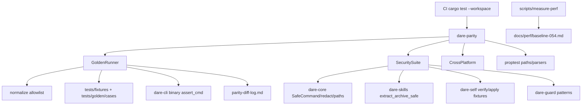

# BLUEPRINT: Hardening de paridade e segurança (Microplano 054)

> **Gerado a partir de:** `DARE/DESIGN-054-hardening-de-paridade-e-seguranca.md` v1.0  
> **Data:** 2026-07-31 | **Status:** APPROVED (tasks geradas via `/dare-tasks`)  
> **Arquivo:** `DARE/BLUEPRINT-054-hardening-de-paridade-e-seguranca.md`  
> **Pré-requisitos:** Roadmap **001–053** DONE · Doc Mestre §42 / §42.2 / §42.4 / §48 · `classification-matrix.md` · `fixtures-inventory.md` · `baseline-3.18.1.md` · path/process **005/006** · guard **034** · self **053** (DEC-054)  
> **Escopo:** crate **`dare-parity`** · `tests/{golden,security,cross-platform}` · normalizer §42.2 · golden runner · security suite · proptest fuzz · perf baselines + gate relativo · docs + **DEC-055**.  
> **Não:** pilotos/RC **055** · npm cutover **056** · capability nova (sem bump 51→52) · Docker · mudança Classe A sem ADR · otimização além de medir+gate.

---

## 0. TRADE-OFFS (Architect)

> `DARE/PATTERNS.md` / `patterns-facts.json` ausentes — trade-offs ancorados em código 🟢 (`assert_cmd`/`predicates` em `dare-cli/tests/*`, `proptest` workspace, `SafeRelativePath`/`SafeCommand`/`redact` em `dare-core`, `extract_archive_safe` em `dare-skills`, cosign fail-closed em `dare-self`, CI `cargo test --workspace` + `cargo audit`).

| # | Trade-off | Escolha | Justificativa |
|---|-----------|---------|---------------|
| T-01 | Onde moram os testes | Crate **`dare-parity`** (`publish = false`) + árvore **`tests/`** na raiz do repo | Microplano cita `tests/golden|security|cross-platform`; crate isola harness sem inflar `dare-cli` |
| T-02 | Baseline TS na CI | **Snapshots commitados** sob `tests/golden/cases/**/expected.*`; live npm **fora** do PR | Hermético; `baseline-3.18.1.md` já tem tarball hash para gov offline |
| T-03 | Capability | **Não** criar `dare-parity` na matrix | DESIGN PM; evita bump 51→52 sem comando CLI novo |
| T-04 | Runner UX | `cargo test -p dare-parity` (integration `[[test]]`) — **sem** binário `dare golden` v1 | Menos superfície CLI; CI já roda `cargo test --workspace` |
| T-05 | Normalizer | Funções puras em `dare-parity::normalize` + allowlist **fechada** §42.2 | RF-06/07; testável sem I/O |
| T-06 | Diff report | Markdown MUST `docs/compatibility/parity-diff-log.md` + JSON SHOULD `tests/golden/last-report.json` (schemaVersion 1) | RNF-07 |
| T-07 | Fuzz PR vs nightly | **`proptest` MUST** no PR; **`cargo-fuzz` SHOULD** nightly / manual (não bloqueia Ralph se ausente) | RNF-10 / R-05 |
| T-08 | Perf limiares absolutos | **Não inventar agora**; Fase F mede → grava `docs/perf/baseline-054.md`; gate CI = **regressão > 15%** vs baseline commitada | DESIGN Analyst 🔴 |
| T-09 | Comando startup | `dare --version` (release) | Mais barato/estável que `dare info` (menos I/O) |
| T-10 | HTTP golden | **1** caso mínimo: `GET /health` (ou equivalente 051) via binário `dare server` em loopback + reuso smokes 051/052 | Evita duplicar suite HTTP |
| T-11 | Docker | **Omitida** | CLI/test harness; alinhado 053 |
| T-12 | Unicode bidi | **MUST** 1 fixture security | DESIGN RS-12 trivial |
| T-13 | DEC | **DEC-055** | DEC-054 = self-update |
| T-14 | Skips | Case YAML `skip: { reason, class }` — skip sem `class` ∈ {A,B,C,D} **falha** a suite | Anti green-falso |
| T-15 | Zip-slip SoT | Reusar / chamar `dare_skills::extract_archive_safe` + regressão em `dare-self` extract; suite security só **orquestra** fixtures | Não duplicar lógica insegura |
| T-16 | Env leak | Assert via `dare_core::redact` + comparação substring do valor secreto **ausente** em stdout/stderr | CI-012 |

### 0.1 Constantes congeladas

| Const | Valor |
|-------|-------|
| `CRATE_NAME` | `dare-parity` |
| `DEC_ID` | `DEC-055` |
| `BASELINE_PKG` | `@dewtech/dare-cli@3.18.1` |
| `GOLDEN_ROOT` | `tests/golden` |
| `SECURITY_ROOT` | `tests/security` |
| `XPLAT_ROOT` | `tests/cross-platform` |
| `DIFF_LOG` | `docs/compatibility/parity-diff-log.md` |
| `HARDENING_DOC` | `docs/compatibility/parity-hardening.md` |
| `PERF_DOC` | `docs/perf/baseline-054.md` |
| `CASE_SCHEMA_VERSION` | `1` |
| `REPORT_SCHEMA_VERSION` | `1` |
| `PERF_REGRESSION_MAX` | `0.15` (15% acima do baseline → fail) |
| `STARTUP_CMD` | `["--version"]` |
| `STARTUP_SAMPLES` | `5` (descarta 1º cold; mediana dos restantes) |
| `FUZZ_PROPTEST_CASES` | `256` (CI default) |
| `MSG_UNCLASSIFIED_DIFF` | `"unclassified parity diff; add entry to parity-diff-log.md"` |
| `MSG_OVER_NORMALIZE` | `"normalizer must not hide contract field changes"` |
| `MSG_SKIP_NEEDS_CLASS` | `"golden skip requires class A|B|C|D"` |
| `SECRET_PLACEHOLDERS` | `REDACTED`, `***`, `ghp_TESTONLY`, `AKIATESTONLY` (nunca tokens reais) |

### 0.2 Dimensões de comparação (RF-03) — enum fechado

```rust
#[derive(Debug, Clone, Copy, PartialEq, Eq, Serialize, Deserialize)]
#[serde(rename_all = "lowercase")]
pub enum CompareAxis {
    Exit,
    Stdout,
    Stderr,
    Tree,    // directory listing relative paths, sorted
    Content, // file bytes/text after normalize
    State,   // dare.config.json / .dare/state.json subset
    Http,    // status + body (normalized JSON)
}
```

Cada case **MUST** listar `axes: [..]`. Eixo ausente = não comparado (não é skip).

### 0.3 Normalizações permitidas (allowlist §42.2) — anti-stub

| Id | Regra concreta | Exemplo |
|----|----------------|---------|
| N-01 | Timestamps ISO-8601 → `1970-01-01T00:00:00Z` | `2026-07-31T12:00:00Z` |
| N-02 | UUID v4 hex → `00000000-0000-4000-8000-000000000000` | |
| N-03 | Paths sob temp (`TMPDIR`/`TEMP`/`CARGO_TARGET_DIR`/tempfile prefix) → `$TMP/` | |
| N-04 | Strip ANSI CSI (`\x1b\[…m`) | |
| N-05 | `\` → `/` em paths relatados | |
| N-06 | Drive letter `C:`/`c:` → `$DRIVE:` | |
| N-07 | Versão semver do binário em banners → `$VERSION` | `0.1.0-alpha.0` |
| N-08 | Tokens matched by `dare_core::redact` patterns → `$REDACTED` | |

**Proibido normalizar:** exit codes, nomes de flags/comandos, chaves JSON de contrato, IDs canônicos de capability, ordering de arrays que ADR-002 exige estável.

### 0.4 Case YAML schema (schemaVersion 1)

```yaml
schemaVersion: 1
id: golden.welcome.help   # ^[a-z0-9]+(\.[a-z0-9_-]+)+$
command: ["welcome", "--help"]   # argv after binary; no shell
cwd_fixture: empty-project       # fixture_id | null
env: {}                          # optional extra env (no real secrets)
axes: [exit, stdout]
expected:
  exit: 0
  stdout_file: expected/stdout.txt   # relative to case dir
# optional:
skip:
  reason: "fixture not materialized yet"
  class: C
  adr_ref: null   # required if class == C for intentional SoT drift
```

**Validação:**
- `schemaVersion == 1`
- `id` match regex acima
- `command` não-vazio; nenhum elemento contém `\0`
- se `skip` presente → `class` ∈ {A,B,C,D}; se `C` → `adr_ref` non-empty **ou** entry correspondente em `parity-diff-log.md`
- `axes` non-empty subset de CompareAxis

### 0.5 Diff report JSON (schemaVersion 1) SHOULD

```json
{
  "schemaVersion": 1,
  "generatedAt": "1970-01-01T00:00:00Z",
  "cases": [
    {
      "id": "golden.welcome.help",
      "status": "pass|fail|skip",
      "failedAxes": [],
      "class": null,
      "message": null
    }
  ],
  "summary": { "pass": 0, "fail": 0, "skip": 0 }
}
```

Escrita em `tests/golden/last-report.json` ao fim do runner (gitignored **ou** overwritten; **não** exigir commit do last-report).

### 0.6 Mapa fixture → comandos (cobertura MUST / skip)

| fixture_id | Comandos golden mínimos (MUST se fixture materializada) | Se ausente |
|------------|----------------------------------------------------------|------------|
| `empty-project` | `welcome --help`, `info`, `discover` (dry), `init --help` | skip class C + reason |
| `existing-node-project` | `discover`, `discover --check` | idem |
| `existing-rust-project` | `discover` | idem |
| `existing-python-project` | `discover` | idem |
| `monorepo` | `discover` | idem |
| `project-with-claude` | `harness claude --help` / validate matrix smoke | idem |
| `project-with-cursor` | idem cursor | idem |
| `project-with-codex` | idem codex | idem |
| `project-with-antigravity` | idem antigravity | idem |
| `project-with-all-harnesses` | `capabilities` list smoke | idem |
| `invalid-config` | comando que carrega config → exit tipado ∈ {2,3,4} | idem |
| `legacy-dag` | `validate` / `dag` read | idem |
| `customized-assets` | `update --dry-run` | idem |
| `windows-path-cases` | só em `tests/cross-platform` (cfg windows + unix separators) | — |

**Goldens CLI adicionais (sem fixture de projeto):** `dare --help` lista comandos-chave; `dare self --help` distingue de `update`; `dare mcp --help`; 1 HTTP health.

**Materialização:** Fase C cria fixtures mínimas sob `tests/fixtures/<fixture_id>/` (stubs suficientes para o comando). Não precisa clone de monorepos reais.

### 0.7 Exit / status do runner

| Situação | `cargo test` |
|----------|--------------|
| Todos pass/skip classificado | ok |
| Fail em eixo | fail + mensagem com `id` + axis |
| Diff sem entrada em diff-log quando esperado Class C | fail `MSG_UNCLASSIFIED_DIFF` |
| Skip sem class | fail `MSG_SKIP_NEEDS_CLASS` |

---

## 1. VISÃO GERAL DA ARQUITETURA

Harness de **observabilidade de contrato** (golden) + **regressão de segurança** + **baselines de engenharia**, sem novo comando de produto.



**Decisões arquiteturais:**

| Decisão | Escolha | Justificativa |
|---------|---------|---------------|
| Crate dedicada | `dare-parity` | Isola deps de teste; não acopla release bin size |
| Snapshots | Commitados | CI sem npm |
| Sem capability | Docs only | Sem comando novo |
| Perf gate | Relativo 15% | Evita limiar absoluto inventado |
| Security | Orquestra APIs existentes | SoT de path/archive já em core/skills/self |

---

## 2. STACK TÉCNICA DEFINIDA

| Camada | Tecnologia | Versão | Papel |
|--------|-----------|--------|-------|
| Linguagem | Rust | workspace `1.88.0` | |
| Crate | `dare-parity` | path member | runners |
| CLI sob teste | `dare-cli` | workspace | binário |
| Core | `dare-core` | workspace | path, process, redact |
| Skills extract | `dare-skills` | workspace | zip/tar safe |
| Self verify | `dare-self` | workspace | checksum/sig fixtures |
| Test | `assert_cmd =2.0.17`, `predicates =3.1.3`, `tempfile =3.20.0` | workspace | |
| Property | `proptest =1.6.0` | workspace | RF-10/11 |
| Serde YAML | `yaml_serde` / pin workspace existente | cases | |
| Hash | `sha2 =0.10.9` | size/checksum smoke | |
| Audit | `cargo-audit =0.22.0` | CI | |

---

## 3. ESTRUTURA DE PASTAS E ARQUIVOS

```text
crates/dare-parity/
  Cargo.toml
  src/
    lib.rs
    axis.rs          # CompareAxis
    case.rs          # load/validate CaseSpec
    normalize.rs     # N-01..N-08
    runner.rs        # run_case / run_suite
    report.rs        # DiffReport JSON
    security/
      mod.rs
      injection.rs
      env_leak.rs
      archive.rs
      signature.rs
      bidi.rs
    fuzz_paths.rs    # proptest modules (cfg test)
    fuzz_parsers.rs
  tests/
    golden_suite.rs
    security_suite.rs
    cross_platform.rs
    normalize_anti_cheat.rs

tests/
  fixtures/
    empty-project/
    existing-node-project/
    ...                # materializar sob demanda por case
  golden/
    cases/
      welcome.help/
        case.yaml
        expected/stdout.txt
      ...
    README.md
  security/
    archives/
      zip-slip.zip
      tar-slip.tar.gz
    injection/
      payloads.txt
    env/
      .gitkeep
    signatures/
      bad-SHA256SUMS
      signing-skipped.sig
  cross-platform/
    windows-path-cases/
      case.yaml

scripts/
  measure-perf.sh
  measure-perf.ps1

docs/
  compatibility/
    parity-hardening.md      # CRIAR
    parity-diff-log.md       # CRIAR
  perf/
    baseline-054.md          # CRIAR após 1ª medida
  DECISION-LOG.md            # APPEND DEC-055

DARE/
  .../000A-MATRIZ-DE-STATUS.md   # 054 Concluído no close
```

Workspace: adicionar `crates/dare-parity` em `Cargo.toml` members.  
CI paths: incluir `tests/**`, `scripts/measure-perf.*`, `docs/perf/**` nos triggers de `ci.yml` (Fase G).

> **Não** `[build] target` global em `.cargo/config.toml`.

---

## 4. MODELO DE DADOS (domínio)

### 4.1 `CaseSpec`

| Campo | Tipo | Constraints |
|-------|------|-------------|
| `schema_version` | `u32` | `== 1` |
| `id` | `String` | regex §0.4 |
| `command` | `Vec<String>` | len ≥ 1; no NUL |
| `cwd_fixture` | `Option<String>` | id em inventário ou None |
| `env` | `BTreeMap<String,String>` | values não podem ser secrets reais |
| `axes` | `Vec<CompareAxis>` | non-empty, unique |
| `expected_exit` | `Option<i32>` | required se axis Exit |
| `expected_stdout_path` | `Option<PathBuf>` | relative |
| `expected_stderr_path` | `Option<PathBuf>` | relative |
| `expected_tree_path` | `Option<PathBuf>` | sorted posix paths |
| `expected_content` | `Vec<ContentExpect>` | path → file |
| `expected_state_path` | `Option<PathBuf>` | JSON subset |
| `expected_http` | `Option<HttpExpect>` | |
| `skip` | `Option<SkipSpec>` | |

```rust
pub struct SkipSpec {
  pub reason: String,        // non-empty
  pub class: DiffClass,      // A|B|C|D
  pub adr_ref: Option<String>,
}
pub enum DiffClass { A, B, C, D }
pub struct ContentExpect { pub rel: String, pub file: PathBuf }
pub struct HttpExpect { pub method: String, pub path: String, pub status: u16, pub body_file: Option<PathBuf> }
```

### 4.2 `CaseResult` / `DiffReport`

Ver §0.5. `failedAxes: Vec<CompareAxis>` serializado lowercase.

### 4.3 `PerfBaseline` (Markdown + front-matter YAML)

```yaml
schemaVersion: 1
targetTriple: x86_64-pc-windows-msvc   # preenchido na medida
startupMedianMs: 0          # preencher Fase F
rssPeakKiB: 0
binarySizeBytes: 0
binarySha256: ""
measuredAt: "ISO-8601"
gitSha: ""
```

Gate: `measured <= baseline * (1 + PERF_REGRESSION_MAX)` por métrica presente.

### 4.4 Relacionamentos

| De | Para | Cardinalidade |
|----|------|---------------|
| CaseSpec | fixture_id | 0..1 |
| CaseSpec | expected files | 1..N |
| Diff log row | CaseSpec.id / ad-hoc id | 1 |
| PerfBaseline | targetTriple | 1 por OS na matrix |

---

## 5. CONTRATOS / APIs DE DOMÍNIO (ANTI-STUB)

> Sem HTTP de produto novo. Contratos = APIs Rust do harness + scripts.

### 5.1 Normalizer

```rust
pub fn normalize_text(input: &str, ctx: &NormalizeCtx) -> String;
pub struct NormalizeCtx {
  pub temp_prefixes: Vec<PathBuf>,
  pub binary_version: Option<String>,
}
```

**Pré:** `input` UTF-8 lossy ok.  
**Pós:** somente transformações N-01..N-08.  
**Erros:** nenhum (pura).

### 5.2 Load / validate case

```rust
pub fn load_case(case_dir: &Path) -> CoreResult<CaseSpec>;
pub fn validate_case(spec: &CaseSpec) -> CoreResult<()>;
```

| Erro | Quando |
|------|--------|
| `InvalidInput` | schemaVersion ≠ 1, id regex fail, axes empty |
| `InvalidInput` | skip sem class / class C sem adr_ref e sem diff-log entry |
| `NotFound` | expected file missing quando axis demanda |

### 5.3 Runner

```rust
pub fn run_case(
  spec: &CaseSpec,
  bin: &Path,                 // dare executable
  fixtures_root: &Path,
  diff_log: &DiffLogIndex,    // parsed parity-diff-log.md
) -> CoreResult<CaseResult>;

pub fn run_suite(
  golden_root: &Path,
  opts: SuiteOpts,
) -> CoreResult<DiffReport>;
```

**Pipeline `run_case` (ordem):**
1. Se `skip` → validate class → return `skip`  
2. Materialize cwd = `fixtures_root/cwd_fixture` ou temp empty  
3. `assert_cmd::Command::new(bin).args(&spec.command).envs(...).current_dir(cwd)`  
4. Timeout **30s** default (`SuiteOpts::timeout`)  
5. Para cada axis: compare normalized actual vs expected  
6. Fail → incluir axis em `failedAxes`

**Concorrência:** suite pode rodar cases em série (MUST v1); paralelo COULD com `CARGO_TARGET_DIR` isolado.

**Edge cases:**
- binary missing → `NotFound`  
- non-UTF8 stdout → lossy + still compare  
- HTTP axis: spawn server helper **somente** se axis Http; bind `127.0.0.1:0`; kill no drop  

### 5.4 Anti over-normalize (teste obrigatório)

```rust
#[test]
fn over_normalize_does_not_hide_exit_code() {
  // expected exit 0, actual 2, texts identical after normalize → MUST fail Exit axis
}
#[test]
fn over_normalize_does_not_hide_json_key() {
  // {"a":1} vs {"b":1} → fail Content/Stdout even if values normalized
}
```

### 5.5 Security suite — funções

```rust
pub fn test_command_injection_payloads(runner: &dyn ProcessRunner) -> CoreResult<()>;
pub fn test_env_leak_absent(bin: &Path, secret: &str) -> CoreResult<()>;
pub fn test_archive_traversal_fixtures(dir: &Path) -> CoreResult<()>;
pub fn test_signature_mismatch_fixtures(dir: &Path) -> CoreResult<()>;
pub fn test_bidi_path_rejected(root: &ProjectRoot) -> CoreResult<()>;
```

| Função | Comportamento esperado |
|--------|------------------------|
| injection | Para cada linha em `tests/security/injection/payloads.txt`, construir `SafeCommand` com payload **como arg único**; `SystemProcessRunner` não deve interpretar metachar; assert: ou spawn argv literal, ou `InvalidInput` se path escape — **nunca** shell |
| env_leak | Set env `GITHUB_TOKEN=ghp_TESTONLY_LEAK_PROBE`, `DARE_AI_API_KEY=sk_TESTONLY`; run `dare --help`, `dare self update --help`, um comando erro forçado; stdout+stderr **não** contém `ghp_TESTONLY_LEAK_PROBE` / `sk_TESTONLY` |
| archive | `extract_archive_safe` em zip-slip/tar-slip → `Err`; dest sem ficheiros `../` |
| signature | Chamar APIs `dare_self::verify_sha256` mismatch → err `MSG_CHECKSUM_MISMATCH`; sig file prefix `signing skipped` → `MSG_SIGNING_SKIPPED`; (cosign missing path já coberto em dare-self — reexport assert) |
| bidi | `SafeRelativePath::new` com U+202E / homoglyph `..` → `Err` PATH_ESCAPE ou InvalidInput |

**payloads.txt** (mínimo MUST):

```text
;rm -rf /
&& whoami
$(reboot)
`id`
arg%0anewline
| cat /etc/passwd
```

### 5.6 Fuzz / property

```rust
proptest! { #![proptest_config(ProptestConfig::with_cases(256))]
  fn safe_relative_path_no_panic(s in "\\PC*") {
    let _ = SafeRelativePath::new(&s);
  }
  fn yaml_case_parse_no_panic(bytes in prop::collection::vec(any::<u8>(), 0..4096)) {
    let _ = CaseSpec::try_from_yaml_bytes(&bytes);
  }
}
```

Malformed bytes → `Err`, **nunca** panic.

### 5.7 Perf scripts

`scripts/measure-perf.sh` / `.ps1`:

1. `cargo build -p dare-cli --release`  
2. Medir `STARTUP_SAMPLES`× `dare --version` → mediana ms  
3. RSS: Windows `Get-Process WorkingSet64`; Unix `ps -o rss=` após startup  
4. `binarySizeBytes` + sha256 do artefato  
5. Escrever/atualizar `docs/perf/baseline-054.md` (humans commitam 1ª vez; CI job **compara** sem rewrite)

CI gate (Fase F/G): se baseline existe para `targetTriple`, falhar se regressão > 15%.

### 5.8 Diff log formato (Markdown table)

```markdown
| diff_id | surface | class | action | adr_ref | notes |
|---------|---------|-------|--------|---------|-------|
| PD-001 | design LLM variance | C | accept native SoT | ADR-xxx / DEC-0yy | ... |
```

`DiffLogIndex::contains(id|surface)` usado por validate_case.

---

## 6. PLANO DE EXECUÇÃO (FASES)

> Fase Docker **omitida** (T-11). Auditoria = penúltima. Close docs = última.

### Fase A — Scaffold `dare-parity` + layout tests
**DONE quando:** `cargo test -p dare-parity` compila; dirs `tests/golden|security|cross-platform` existem com README; `load_case` rejeita schema inválido (unit).  
**Entregáveis:** crate member, árvore §3, `CaseSpec` + validate.

### Fase B — Normalizer + anti over-normalize
**DONE quando:** testes N-01..N-08 + `normalize_anti_cheat` vermelhos se exit/key mudam.  
**Entregáveis:** `normalize.rs`, tests.

### Fase C — Golden suite + fixtures mínimas + diff-log
**DONE quando:** `cargo test -p dare-parity --test golden_suite` verde; ≥1 case real por comando help crítico; skips classificados; `parity-diff-log.md` inicial (pode ter rows C existentes).  
**Entregáveis:** runner, cases, fixtures stub, report JSON SHOULD.

### Fase D — Security suite
**DONE quando:** `cargo test -p dare-parity --test security_suite` verde; injection/env/archive/sig/bidi MUST.  
**Entregáveis:** fixtures security + modules.

### Fase E — proptest + cross-platform
**DONE quando:** property tests paths/parsers no PR; `cross_platform` passa em matrix (windows cases `cfg`); documentado cargo-fuzz SHOULD.  
**Entregáveis:** `fuzz_*.rs`, `tests/cross-platform/**`.

### Fase F — Perf measure + gate
**DONE quando:** scripts rodam; `docs/perf/baseline-054.md` preenchido para ≥1 triple; teste/CI step falha se `>15%` (fixture com baseline fake no unit).  
**Entregáveis:** scripts, doc, gate helper.

### Fase G — Docs DEC-055 + CI paths + Ralph / audit ← **N-1 segurança + N docs**
**DONE quando:** `parity-hardening.md` + DEC-055 append-only; matriz 000A 054 Concluído; `ci.yml` paths incluem `tests/**`;  
`cargo fmt --check && cargo test -p dare-parity && cargo test -p dare-cli --test cli_smoke && cargo clippy -p dare-parity --all-targets -- -D warnings && cargo audit` exit 0.  
**Entregáveis:** docs, DEC, CI tweak, Ralph close.

---

## 7. VALIDAÇÃO E SEGURANÇA

### Validation Gates (Ralph)

| Stack | Build | Test | Lint/Audit |
|-------|-------|------|------------|
| Rust | `cargo build -p dare-parity -p dare-cli` | `cargo test -p dare-parity` + smokes críticos | `cargo clippy -p dare-parity --all-targets -- -D warnings` + `cargo audit` |

Close microplano: também `cargo fmt --check` e `cargo test --workspace` (ou equivalente CI).

### Controles ↔ RS / fases

| Controle | RS | Fase |
|----------|----|------|
| Validação case/fixtures | RS-01 | A/C |
| Placeholders only | RS-02 | C/D |
| Jail tempfile/ProjectRoot | RS-03 | C/D/E |
| cargo audit | RS-04 | G |
| Sem secrets CI | RS-05 | C/G |
| Path traversal tests | RS-06 | D/E |
| SafeCommand injection | RS-07 | D |
| Env leak | RS-08 | D |
| Zip/tar slip | RS-09 | D |
| Signature mismatch | RS-10 | D |
| Fuzz não bypass jail | RS-11 | E |
| Bidi path | RS-12 | D |

Checklist:

- [ ] Sem shell concatenado nas suites
- [ ] Sem CVE HIGH/CRITICAL
- [ ] Sem secrets reais em fixtures
- [ ] Diffs Class D bloqueiam
- [ ] Normalizer allowlist only

---

## 8. ESTRATÉGIA DE TESTES

| Tipo | Ferramenta | O que cobre |
|------|-----------|-------------|
| Unit | `cargo test -p dare-parity` | normalize, case validate, diff-log parse, perf gate math |
| Integration golden | `--test golden_suite` | exit/stdout/stderr/tree/content/state/http |
| Integration security | `--test security_suite` | injection, leak, archive, sig, bidi |
| Cross-platform | `--test cross_platform` | separators, drive casing |
| Property | proptest 256 | paths + malformed YAML/JSON |
| Fuzz SHOULD | cargo-fuzz | nightly |
| Regression CLI | `dare-cli` smokes existentes | não regredir help/capabilities |
| Audit | cargo audit | deps |

---

## 9. ESTRATÉGIA DE DEPLOY

| Ambiente | Branch | Trigger | Ação |
|----------|--------|---------|------|
| PR | feature/* | push | `ci.yml` quality + dare-parity |
| main | main | push | idem |
| Nightly SHOULD | schedule | cron | cargo-fuzz path_safety (se adicionado) |
| Release | tag | `release.yml` | inalterado; size smoke pode alimentar baseline |

**Não** publica RC neste microplano (055).

Artefato instalável (RF-26): `cargo build --release -p dare-cli` + checksum local no script perf satisfaz “smoke instalável” sem publish.

---

## 10. CHECKLIST DE APROVAÇÃO DO BLUEPRINT

- [ ] Crate `dare-parity` + `tests/` na raiz aceitos (T-01)
- [ ] Snapshots commitados (sem npm no PR) aceitos (T-02)
- [ ] Sem capability nova aceito (T-03)
- [ ] Allowlist N-01..N-08 + anti over-normalize aceitos
- [ ] Case YAML schemaVersion 1 aceito
- [ ] Mapa fixture→comandos + skip classificado aceito
- [ ] Security orquestra core/skills/self (não reimplementa extract) aceito
- [ ] Perf: medir → baseline; gate **15%** aceito (T-08)
- [ ] DEC-055 / sem Docker / sem 055-056 aceitos
- [ ] Fases A–G com DONE verificável aceitas
- [ ] Aprovar para `/dare-tasks` → `TASKS-054` + `dare-dag-054.yaml` + `EXECUTION-054/`

---

## Notas Architect (passagem única)

| Id padrão 🟢 | Trade-off | Conclusão 🟡 |
|--------------|-----------|--------------|
| `assert_cmd` smokes em `dare-cli/tests` | runner CLI | reutilizar padrão Command/cargo_bin |
| `proptest` em `dare-dag` | fuzz PR | mesmo pin workspace |
| `SafeCommand` + runner tests env | injection/leak | estender cobertura via dare-parity |
| `extract_archive_safe` | zip-slip | chamar, não copiar |
| CI `cargo test --workspace` | discovery | member novo entra automaticamente |

---

## Próximas etapas

1. Revisar e **aprovar** este Blueprint (especialmente T-01 layout, T-08 gate 15%, mapa de fixtures).  
2. Rodar `/dare-tasks` com `@DARE/BLUEPRINT-054-hardening-de-paridade-e-seguranca.md`.  
3. Executar DAG 054 até Ralph close + DEC-055.
