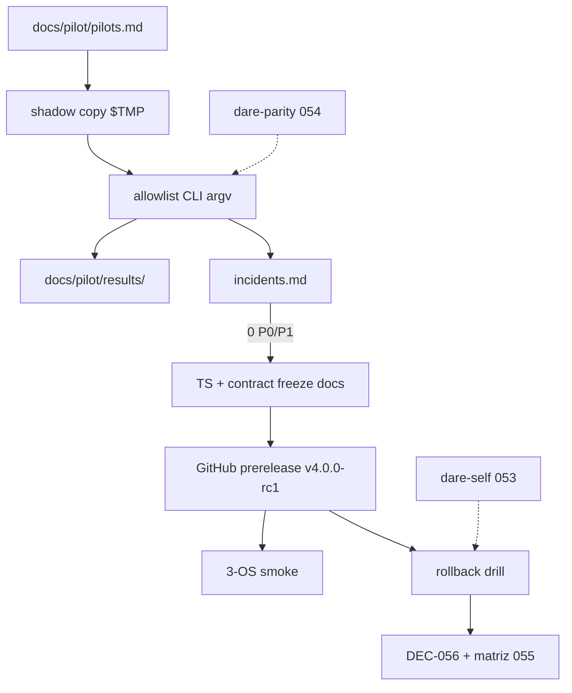

# BLUEPRINT: Pilotos, shadow tests e release candidate (Microplano 055)

> **Gerado a partir de:** `DARE/DESIGN-055-pilotos-shadow-tests-e-release-candidate.md` v1.0  
> **Data:** 2026-07-31 | **Status:** APPROVED (tasks geradas via `/dare-tasks`)  
> **Arquivo:** `DARE/BLUEPRINT-055-pilotos-shadow-tests-e-release-candidate.md`  
> **Pré-requisitos:** **054** DONE (DEC-055 / `dare-parity`) · **053** self-update · Doc Mestre §46–47 · `fixtures-inventory.md` · `breaking-change-process.md` · ADR-008 · release.yml  
> **Escopo:** `docs/pilot/**` · `docs/release-candidate/**` · shadow isolado · ≥3 pilotos · 0 P0/P1 · freeze TS · tag RC · rollback drill · **DEC-056**.  
> **Não:** cutover/stable/npm legacy **056** · CLI `dare pilot` · capability nova · Docker · mudança Classe A sem ADR.

---

## 0. TRADE-OFFS (Architect)

> `DARE/PATTERNS.md` / `patterns-facts.json` ausentes — trade-offs ancorados em 🟢 (`dare-parity` golden/security, `dare self` / DEC-054, `release.yml` `prerelease: true`, `breaking-change-process.md`, `fixtures-inventory.md`, measure-perf scripts).

| # | Trade-off | Escolha | Justificativa |
|---|-----------|---------|---------------|
| T-01 | Superfície produto | **Docs + scripts** — sem `dare pilot` | DESIGN PM; zero bump de capability |
| T-02 | Capability | **Não** criar row nova (matrix permanece 51) | Igual 054 |
| T-03 | Pilotos reais vs synthetic | Preferir reais; **synthetic OK** com `synthetic: true` desde que cubram OS + fluxos | R-02; inventário 054 |
| T-04 | Isolamento shadow | **Cópia obrigatória** (`git worktree` ou `robocopy`/`rsync`/`Copy-Item`) para dir sob `$TMP/dare-pilot-<id>-*` | Nunca write no original |
| T-05 | Script shadow | Playbook **MUST**; `scripts/pilot-shadow.ps1` + `.sh` **SHOULD** | Automação ajuda; não bloqueia se checklist assinado |
| T-06 | Tag RC | **`v4.0.0-rc1`** (prerelease GitHub) | Major **4** após baseline npm **3.18.1**; `release.yml` já marca prerelease |
| T-07 | Canal `dare self` | Default **`beta` inalterado**; instalar RC via **`--version v4.0.0-rc1`** (ou tag normalizada) | Evita redirect silencioso stable/beta |
| T-08 | Janela shadow | **≥3 ciclos** documentados por piloto (não calendário rígido de 5 dias) | Executável no DAG; RNF-08 |
| T-09 | Comparação | Reusar eixos `dare-parity` / playbook manual com evidência em `docs/pilot/results/<id>/` | RF-06 SHOULD |
| T-10 | Contract freeze CI | Checklist MUST em `contract-freeze.md`; job CI auto **SHOULD** (label/ADR no PR) | breaking-change já COULD |
| T-11 | Docker | **Omitida** | CLI/release |
| T-12 | DEC | **DEC-056** | DEC-055 = hardening |
| T-13 | SBOM | **SHOULD** no Release se pipeline já gera; senão documentar gap | RF-12 |
| T-14 | Idioma UX pública | Release notes + install/rollback em **en-US**; playbooks DARE podem PT | RF-25 |

### 0.1 Constantes congeladas

| Const | Valor |
|-------|-------|
| `DEC_ID` | `DEC-056` |
| `RC_TAG` | `v4.0.0-rc1` |
| `RC_VERSION_CORE` | `4.0.0-rc1` |
| `MIN_PILOTS` | `3` |
| `MIN_SHADOW_CYCLES` | `3` |
| `SELF_DEFAULT_CHANNEL` | `beta` (unchanged) |
| `PILOT_DOC` | `docs/pilot/pilots.md` |
| `SHADOW_PLAYBOOK` | `docs/pilot/shadow-playbook.md` |
| `INCIDENTS_DOC` | `docs/pilot/incidents.md` |
| `RESULTS_ROOT` | `docs/pilot/results/` |
| `RC_NOTES` | `docs/release-candidate/RELEASE-NOTES.md` |
| `TS_FREEZE` | `docs/release-candidate/typescript-freeze.md` |
| `CONTRACT_FREEZE` | `docs/release-candidate/contract-freeze.md` |
| `ROLLBACK_DRILL` | `docs/release-candidate/rollback-drill.md` |
| `SHADOW_SCRIPT_PS1` | `scripts/pilot-shadow.ps1` |
| `SHADOW_SCRIPT_SH` | `scripts/pilot-shadow.sh` |
| `ALLOWLIST_CMDS` | `welcome`, `info`, `discover`, `discover --check`, `validate`, `update --dry-run`, `self --help`, `mcp --help`, `capabilities`, `harness … --help`, `--version`, `--help` |
| `MSG_WRITE_ORIGINAL` | `"shadow must not write to the original pilot tree"` |
| `MSG_OPEN_P0_P1` | `"cannot close microplano 055 while P0/P1 incidents are open"` |

### 0.2 Severidade (fechada)

| Sev | Definição | Fecha 055? |
|-----|-----------|------------|
| **P0** | Data loss, security bypass, CLI inutilizável | Bloqueia se `open` |
| **P1** | Fluxo MUST do piloto falha sem workaround aceito | Bloqueia se `open` |
| **P2** | Workaround documentado | OK fechar |
| **P3** | Cosmético / docs | OK fechar |

Status incidente: `open` \| `mitigated` \| `closed` \| `wontfix` (wontfix exige class C/D + ADR/diff-log).

### 0.3 Schema `pilots.md` (anti-stub)

Cada piloto é uma seção + front-matter YAML por bloco **ou** tabela com colunas obrigatórias:

| Campo | Tipo | Regra |
|-------|------|-------|
| `pilot_id` | string | `^[a-z0-9]+(-[a-z0-9]+)*$` |
| `synthetic` | bool | default false |
| `stack` | string | ex. `node`, `rust`, `python`, `mixed` |
| `os` | enum | `linux` \| `macos` \| `windows` |
| `owner` | string | humano/time (sem email obrigatório) |
| `source` | string | path relativo fixture **ou** URL git pública; se path privado → só `fixture:<id>` |
| `consent` | bool | must be `true` |
| `flows` | list | ≥1 fluxo MUST com `command[]` ⊆ allowlist **ou** justificado |
| `shadow_cycles_done` | u32 | ≥ `MIN_SHADOW_CYCLES` no close |

**Conjunto mínimo de 3 pilotos (seed Blueprint — execução pode substituir por reais):**

| pilot_id | synthetic | os | source |
|----------|-----------|-----|--------|
| `pilot-linux-empty` | true | linux | `fixture:empty-project` |
| `pilot-macos-node` | true | macos | `fixture:existing-node-project` |
| `pilot-windows-rust` | true | windows | `fixture:existing-rust-project` |

Se o host de execução for um único OS, rodar os 3 synthetic nesse OS **e** marcar smoke RC multi-OS via CI matrix (O-12). Preferir owners reais quando disponíveis.

### 0.4 Schema incidente (`incidents.md` table)

```markdown
| id | sev | pilot_id | status | compat_class | summary | repro | opened | closed |
| INC-001 | P1 | pilot-linux-empty | open | B | … | … | ISO-8601 | |
```

`compat_class` ∈ {A,B,C,D}. Se C → `adr_ref` ou linha em `parity-diff-log.md`.

### 0.5 Contrato shadow script (SHOULD)

```text
pilot-shadow --pilot-id <id> --source <path> --dare-bin <path> [--ts-bin <path>]
```

**Pré:** `source` existe e é dir; `dare-bin` executável.  
**Passos (ordem):**
1. Criar `SHADOW_ROOT=$TMP/dare-pilot-<id>-<uuid>`  
2. Copiar árvore **exceto** `.git` opcional (prefer incluir `.git` se compare precisar) — **nunca** `cd` write no source  
3. Assert: mtime/hash sample files do **source** inalterados após run (spot-check ≥3 files)  
4. Executar allowlist commands com cwd=`SHADOW_ROOT` via argv array (no shell)  
5. Escrever log redacted em `docs/pilot/results/<id>/cycle-<n>.md`  
6. Exit 0 se todos fluxos pass/skip classificado; ≠0 se P0/P1 detectado  

**Erros tipados (exit):** 2 usage · 3 path · 4 policy (write original / cmd fora allowlist) · 5 IO · 6 verify/compare fail.

### 0.6 Publicação RC (anti-stub)

1. Bump/`[workspace.package] version` ou tag-only conforme política repo (Blueprint: **tag `v4.0.0-rc1`** dispara `release.yml`)  
2. Assets: binários por triple + `SHA256SUMS` + `.sig`  
3. GitHub Release **prerelease=true**  
4. `RELEASE-NOTES.md` en-US: not a stable cutover; install; known issues; freeze; rollback  
5. Smoke matrix: Linux/macOS/Windows → `--version`, `info`, `--help`  
6. Document install: download asset **or** `dare self update --version 4.0.0-rc1` / `v4.0.0-rc1` (exact tag match per 053)

### 0.7 Rollback drill (anti-stub)

Arquivo `rollback-drill.md` MUST conter:

| Campo | Obrigatório |
|-------|-------------|
| `operator` | sim |
| `date` | ISO-8601 |
| `os` | sim |
| `from_version` | RC tag |
| `to_version` | tag/binário anterior conhecido |
| `method_a` | `dare self rollback` result (ok/fail/skip+reason) |
| `method_b` | reinstall previous asset result |
| `post_smoke` | `--version` output |
| `result` | `PASS` |

Close 055 exige `result: PASS` em ≥1 OS (prefer Windows **ou** Linux + nota).

---

## 1. VISÃO GERAL DA ARQUITETURA

Processo operacional + documentação + release — **não** novo domínio de produto.



**Decisões:**

| Decisão | Escolha | Justificativa |
|---------|---------|---------------|
| Sem CLI nova | docs/scripts | Escopo 055 é validação/release |
| Synthetic pilots | permitidos | Desbloqueia DAG sem N NDAs |
| RC tag fixa | `v4.0.0-rc1` | Determinismo de tasks; major pós-3.18.1 |
| Self channel | beta default | RC só por `--version` |

---

## 2. STACK TÉCNICA DEFINIDA

| Camada | Tecnologia | Versão | Papel |
|--------|-----------|--------|-------|
| CLI | `dare-cli` | workspace 1.88 | sob teste |
| Parity | `dare-parity` | 054 | compare SHOULD |
| Self | `dare-self` | 053 | rollback |
| CI release | `.github/workflows/release.yml` | existente | prerelease |
| Scripts | PowerShell 7+ / bash | — | shadow SHOULD |
| Docs | Markdown | — | MUST |
| Audit | cargo-audit | 0.22.0 | close |

---

## 3. ESTRUTURA DE PASTAS E ARQUIVOS

```text
docs/pilot/
  pilots.md                 # CRIAR
  shadow-playbook.md        # CRIAR
  incidents.md              # CRIAR (tabela; pode começar vazia)
  results/
    .gitkeep
    <pilot_id>/
      cycle-1.md            # evidência redacted
      cycle-2.md
      cycle-3.md
docs/release-candidate/
  RELEASE-NOTES.md          # CRIAR en-US
  typescript-freeze.md      # CRIAR
  contract-freeze.md        # CRIAR
  rollback-drill.md         # CRIAR (preencher no drill)
scripts/
  pilot-shadow.ps1          # SHOULD
  pilot-shadow.sh           # SHOULD
docs/compatibility/
  README.md                 # MOD — links pilot + RC
  parity-diff-log.md        # MOD se gaps novos
docs/DECISION-LOG.md        # APPEND DEC-056
tests/fixtures/             # materializar synthetic se ausentes (reuse 054)
.github/workflows/
  ci.yml                    # SHOULD: note/docs paths; optional ADR check
DARE/
  .../000A-MATRIZ-DE-STATUS.md
```

---

## 4. MODELO DE DADOS

### 4.1 PilotRecord

Ver §0.3.

### 4.2 IncidentRecord

Ver §0.4.

### 4.3 ShadowCycleReport (`results/<id>/cycle-N.md`)

| Campo | Tipo |
|-------|------|
| `pilot_id` | string |
| `cycle` | u32 |
| `shadow_root` | path (temp; pode omitir se sensível) |
| `commands` | list `{argv, exit, notes}` |
| `source_integrity` | `pass` \| `fail` (spot-check) |
| `verdict` | `pass` \| `fail` \| `skip` |

### 4.4 Relacionamentos

| De | Para | Card |
|----|------|------|
| Pilot | ShadowCycle | 1:N (≥3) |
| Incident | Pilot | N:1 |
| Incident | parity-diff / ADR | 0..1 |

---

## 5. CONTRATOS / APIs (ANTI-STUB)

> Sem HTTP de produto. Contratos = schemas docs + scripts + processo release.

### 5.1 `assert_no_write_to_source(source, fingerprints) -> Result<()>`

Fingerprint = lista `(rel_path, sha256)` capturada **antes** do shadow.  
Pós: recalcular; mismatch → Err `MSG_WRITE_ORIGINAL` / exit 4.

### 5.2 Allowlist enforcement

Qualquer argv cujo binário não seja `dare`/`dare.exe` **ou** subcomando fora de `ALLOWLIST_CMDS` → exit 4 (exceto `--version`/`--help` top-level).

### 5.3 Gate close (humano + checklist)

```text
close_055_ok :=
  pilots.count >= 3
  AND forall pilots: shadow_cycles_done >= 3
  AND incidents.filter(sev in {P0,P1} AND status==open).empty
  AND RC_TAG published (prerelease)
  AND rollback_drill.result == PASS
  AND cargo fmt/clippy/test/audit OK
```

### 5.4 Contract freeze checklist (MUST items in doc)

- [ ] No Classe A change without ADR Accepted link  
- [ ] `classification-matrix.md` updated if applicable  
- [ ] DECISION-LOG entry if waiver  
- [ ] PR description cites `ADR-` when touching exit/flags/JSON schema/IDs  

### 5.5 TypeScript freeze policy (MUST text)

> From RC tag date forward, `@dewtech/dare-cli` TypeScript line accepts **security fixes only**. Feature PRs to TS legacy are rejected until after microplano 056 policy supersedes this freeze.

---

## 6. PLANO DE EXECUÇÃO (FASES)

> Docker **omitida** (T-11). Auditoria = penúltima. Close = última.

### Fase A — Inventário de pilotos + fixtures synthetic
**DONE quando:** `pilots.md` tem ≥3 entradas válidas (§0.3), consent=true; fixtures `empty-project`, `existing-node-project`, `existing-rust-project` materializadas o suficiente para os fluxos; critérios de seleção documentados no próprio `pilots.md`.  
**Entregáveis:** `docs/pilot/pilots.md`, fixtures sob `tests/fixtures/` se faltarem.

### Fase B — Shadow playbook + script SHOULD + integrity helper
**DONE quando:** `shadow-playbook.md` publicado; script ps1/sh implementa cópia + allowlist + fingerprint check **ou** playbook tem checklist equivalente testado 1×; unit/smoke do fingerprint se script existir.  
**Entregáveis:** playbook, scripts SHOULD, `results/.gitkeep`.

### Fase C — Executar ≥3 ciclos + incidents
**DONE quando:** cada piloto tem `cycle-1..3.md`; `incidents.md` atualizado; **zero** P0/P1 `open` (fix ou classificar + mitigar).  
**Entregáveis:** results/, incidents.md, updates parity-diff-log se C.

### Fase D — Freeze TS + contract freeze
**DONE quando:** `typescript-freeze.md` + `contract-freeze.md` mergeados; link em compatibility README.  
**Entregáveis:** docs freeze.

### Fase E — Publicar RC + notes + smoke 3 OS
**DONE quando:** Release GitHub `v4.0.0-rc1` prerelease com assets/SUMS/sig; `RELEASE-NOTES.md`; smoke checklist 3 OS (CI e/ou anexos results).  
**Entregáveis:** tag/release, notes, smoke log.

### Fase F — Rollback drill
**DONE quando:** `rollback-drill.md` com `result: PASS` (§0.7).  
**Entregáveis:** drill doc.

### Fase G — DEC-056 + matriz + Ralph/audit ← **N-1 + N**
**DONE quando:** DEC-056 append-only; matriz 000A 055 Concluído;  
`cargo fmt --check && cargo test -p dare-parity && cargo test -p dare-cli --test cli_smoke && cargo clippy -p dare-parity -p dare-cli --all-targets -- -D warnings && cargo audit` exit 0;  
gate §5.3 satisfeito.  
**Entregáveis:** DEC, matriz, TASKS statuses, Ralph close.

---

## 7. VALIDAÇÃO E SEGURANÇA

### Ralph gates

| Build | Test | Lint/Audit |
|-------|------|------------|
| `cargo build -p dare-cli -p dare-parity` | `cargo test -p dare-parity` + `cli_smoke` | clippy `-D warnings` + `cargo audit` |

### RS → Fase

| RS | Fase |
|----|------|
| RS-01 allowlist/paths | B/C |
| RS-02 redact/PII | C/E |
| RS-03 copy-only writes | B/C |
| RS-04 audit | G |
| RS-05 secrets CI | E |
| RS-06 sig/sums | E |
| RS-07 argv | B |
| RS-08 TS freeze | D |
| RS-09 rollback clean | F |
| RS-10 consent | A |

Checklist: sem shell concat · sem secrets em results · RC assinado · 0 P0/P1 open.

---

## 8. ESTRATÉGIA DE TESTES

| Tipo | O que |
|------|--------|
| Unit/smoke script | fingerprint / allowlist reject |
| Integração shadow | 3 ciclos × ≥3 pilotos |
| Reuso 054 | `dare-parity` suites regressão no close |
| Release smoke | `--version` / `info` / `--help` × 3 OS |
| Rollback | drill PASS |
| Audit | cargo audit |

---

## 9. ESTRATÉGIA DE DEPLOY

| Ambiente | Trigger | Ação |
|----------|---------|------|
| PR | push | ci.yml (parity) |
| RC | tag `v4.0.0-rc1` | release.yml prerelease |
| Stable | **fora** (056) | — |

---

## 10. CHECKLIST DE APROVAÇÃO DO BLUEPRINT

- [ ] Sem CLI `dare pilot` / sem capability nova (T-01/T-02)
- [ ] Synthetic pilots + seed table §0.3 aceitos
- [ ] Tag `v4.0.0-rc1` + self `--version` (T-06/T-07) aceitos
- [ ] ≥3 ciclos shadow (T-08) aceitos
- [ ] Gate 0 P0/P1 + rollback PASS aceitos
- [ ] Docker omitida / DEC-056 aceitos
- [ ] Fases A–G com DONE verificável aceitas
- [ ] Aprovar para `/dare-tasks` → `TASKS-055` + `dare-dag-055.yaml` + `EXECUTION-055/`

---

## Notas Architect (passagem única)

| 🟢 Âncora | Conclusão 🟡 |
|-----------|--------------|
| `dare-parity` | consumir, não fork |
| `release.yml` prerelease | encaixa tag **`v4.0.0-rc1`** |
| `dare self --version` | distribui RC sem mudar default beta |
| breaking-change-process | base do contract-freeze |
| fixtures-inventory | seed synthetic |

---

## Próximas etapas

1. Revisar e **aprovar** este Blueprint (tag **`v4.0.0-rc1`**, synthetic seed, 3 ciclos).  
2. Rodar `/dare-tasks` com `@DARE/BLUEPRINT-055-pilotos-shadow-tests-e-release-candidate.md`.  
3. Executar DAG 055 até Ralph close + DEC-056.
