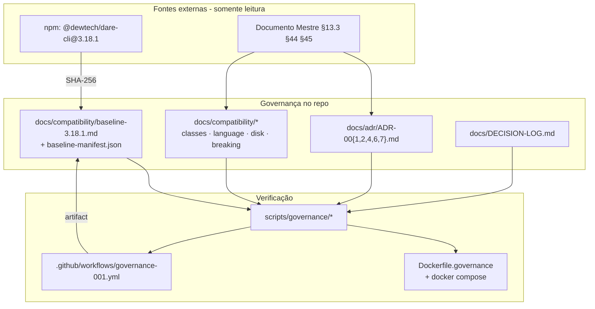

# BLUEPRINT: Governança, baseline e ADRs prioritárias (Microplano 001)

> **Gerado a partir de:** `DARE/DESIGN.md` v1.0  
> **Data:** 2026-07-20 | **Status:** DRAFT  
> **Fonte:** Microplano 001 · Documento Mestre (baseline `@dewtech/dare-cli` v3.18.1)

---

## 0. TRADE-OFFS (Architect)

`DARE/PATTERNS.md` e `DARE/patterns-facts.json` **não existem** neste repositório — nenhuma pergunta ancorada em `DiscoveredPattern` 🟢 do CLI. Decisões abaixo são 🟡 derivadas do Design + Documento Mestre.

| # | Trade-off | Escolha | Justificativa |
|---|-----------|---------|---------------|
| T-01 | Stub Cargo agora vs waiver para 002 | **Waiver explícito** no decision log; gates `cargo *` transferidos ao microplano 002 | Stub Cargo em 001 duplicaria ownership com 002 e fingiria workspace maduro; RNF-04 do Design autoriza deferência documentada |
| T-02 | Hash via npm tarball vs commit git | **npm pack / tarball publicado** `@dewtech/dare-cli@3.18.1` + SHA-256 | Reproduzível sem acesso ao monorepo interno; alinhado à versão de produção citada no Doc Mestre |
| T-03 | ADR-003 completo vs política mínima de idioma | **Política operacional em `docs/compatibility/language-policy.md`**; ADR-003 fica backlog | Design RF-08/Apêndice B — não expandir ADRs neste ciclo |
| T-04 | CI de docs vs “release instalável” binário | **Workflow CI + artefato `baseline-manifest.json`** (hash + metadados) | Satisfaz RNF-05 sem binário Rust (fora de escopo 001) |

---

## 1. VISÃO GERAL DA ARQUITETURA

Arquitetura **documental + verificação determinística** (não há API HTTP de produto neste microplano). O “sistema” é um **repositório de contratos de governança** versionado em Git, validado por scripts e por um container de checagem.

Camadas lógicas:

1. **Baseline** — manifesto imutável da referência TypeScript 3.18.1 (versão + hash + origem).
2. **ADRs** — decisões arquiteturais Accepted (001, 002, 004, 006, 007).
3. **Compatibility pack** — classes A–D, políticas (idioma, JSON, disco), processo de breaking change.
4. **Decision log** — rastreio de decisões/responsáveis + waiver cargo→002.
5. **Verification harness** — scripts + Docker/CI que falham se estrutura/hashes/frontmatter estiverem inválidos.



**Decisões arquiteturais principais:**

| Decisão | Escolha | Justificativa |
|---------|---------|---------------|
| Forma do entregável | Markdown + JSON manifesto + scripts shell/Node mínimos | Escopo Design = `docs/adr` + `docs/compatibility`; scripts só para tornar O-01/RNF-02 verificáveis |
| Gate de qualidade 001 | CI de governança (estrutura + hash); **não** `cargo *` | T-01 / R-03 do Design |
| Formato ADR | MADR-lite (Status, Contexto, Decisão, Consequências, Aceite) | Padroniza leitura ≤ 30 min (RNF-01) |
| Idioma dos docs de governança | Português | Restrição Design §9 |
| Idioma runtime CLI (política) | Inglês canônico para código novo; preservar strings PT Classe A até ADR-003 | Fecha RF-08 sem ADR-003 completo |
| Autenticação HTTP | N/A | Sem endpoints de produto |

---

## 2. STACK TÉCNICA DEFINIDA

| Camada | Tecnologia | Versão | Papel |
|--------|-----------|--------|-------|
| Documentação | Markdown (UTF-8, LF) | — | ADRs e políticas |
| Manifesto | JSON | RFC 8259 | `baseline-manifest.json` |
| Linguagem alvo (futuro) | Rust | *definida no microplano 002* | Fora do escopo 001 |
| Baseline de referência | `@dewtech/dare-cli` | **3.18.1** | Hash SHA-256 do tarball npm |
| Runtime dos scripts de verificação | Node.js | **20.x LTS** (somente CI/local verify) | `npm pack` + crypto; não é runtime do produto Rust |
| Shell | bash / PowerShell | — | Wrappers cross-OS documentados |
| Container | Docker Engine | **24+** | Imagem de validação de governança |
| Compose | Docker Compose | **2.x** | Serviço `governance-check` |
| CI | GitHub Actions | `ubuntu-latest` | Workflow `governance-001.yml` |
| Issue tracking | GitHub Issues | — | Épico 001 (SHOULD) |

---

## 3. ESTRUTURA DE PASTAS E ARQUIVOS

Arquivos **novos** deste microplano (árvore completa a criar):

```text
dare-cli/
├── docs/
│   ├── adr/
│   │   ├── README.md                 # índice + status das ADRs
│   │   ├── ADR-001-compatibilidade-bugs-legados.md
│   │   ├── ADR-002-contrato-saida-json.md
│   │   ├── ADR-004-rest-compativel-e-mcp-real.md
│   │   ├── ADR-006-compatibilidade-migracao-graph-db.md
│   │   └── ADR-007-formato-canonico-capabilities.md
│   ├── compatibility/
│   │   ├── README.md                 # mapa do pacote de compatibilidade
│   │   ├── baseline-3.18.1.md        # narrativa + comando de verificação
│   │   ├── baseline-manifest.json    # fonte canônica máquina-legível
│   │   ├── classification-matrix.md  # classes A–D + itens conhecidos
│   │   ├── language-policy.md        # política operacional de idioma (RF-08)
│   │   ├── disk-and-json-policy.md   # JSON + versionamento de disco (RF-09)
│   │   ├── breaking-change-process.md
│   │   └── fixtures-inventory.md     # RF-12 SHOULD
│   └── DECISION-LOG.md               # RF-10 + waiver cargo (T-01)
├── scripts/
│   └── governance/
│       ├── package.json              # name: dare-governance-verify, private
│       ├── verify-baseline.mjs       # calcula/compara SHA-256
│       ├── verify-adr-frontmatter.mjs
│       ├── verify-structure.mjs      # arquivos obrigatórios presentes
│       └── verify-all.mjs            # orquestra exit codes
├── Dockerfile.governance
├── docker-compose.governance.yml
├── .env.governance.example
├── .github/
│   └── workflows/
│       └── governance-001.yml
└── DARE/
    ├── DESIGN.md                     # já existe
    └── BLUEPRINT.md                  # este arquivo
```

> **Constraints Rust:** não criar `.cargo/config.toml` com `[build] target` global neste microplano (e nunca no workspace futuro — quebra crates mistos). Workspace Cargo = microplano 002.

---

## 4. MODELO DE DADOS

Não há banco relacional. Entidades são **artefatos versionados** com schemas obrigatórios.

### 4.1 Entidade: `BaselineManifest`

Arquivo: `docs/compatibility/baseline-manifest.json`

| Campo | Tipo | Nullable | Default | Constraints |
|-------|------|----------|---------|-------------|
| `schema_version` | string | não | — | exatamente `"1.0"` |
| `package_name` | string | não | — | exatamente `"@dewtech/dare-cli"` |
| `package_version` | string | não | — | exatamente `"3.18.1"` |
| `source` | string | não | — | enum: `"npm"` \| `"git"` — neste ciclo: `"npm"` |
| `resolved_url` | string | não | — | URL HTTPS do tarball resolvido (preencher após `npm view`/`npm pack`) |
| `content_hash_alg` | string | não | — | exatamente `"sha256"` |
| `content_hash` | string | não | — | regex `^[a-f0-9]{64}$` |
| `recorded_at` | string | não | — | ISO-8601 UTC (`YYYY-MM-DDTHH:mm:ssZ`) |
| `recorded_by` | string | não | — | handle/nome do responsável (sem email se PII sensível) |
| `verification_command` | string | não | — | comando canônico documentado (ver §5.2) |
| `notes` | string | sim | `null` | sem secrets; máx. 2000 chars |

**Exemplo concreto (após medição real do hash — substituir `content_hash` na implementação):**

```json
{
  "schema_version": "1.0",
  "package_name": "@dewtech/dare-cli",
  "package_version": "3.18.1",
  "source": "npm",
  "resolved_url": "https://registry.npmjs.org/@dewtech/dare-cli/-/dare-cli-3.18.1.tgz",
  "content_hash_alg": "sha256",
  "content_hash": "aaaaaaaaaaaaaaaaaaaaaaaaaaaaaaaaaaaaaaaaaaaaaaaaaaaaaaaaaaaaaaaa",
  "recorded_at": "2026-07-20T22:00:00Z",
  "recorded_by": "dare-labs",
  "verification_command": "node scripts/governance/verify-baseline.mjs",
  "notes": "Hash do tarball npm oficial; não do diretório descompactado."
}
```

### 4.2 Entidade: `AdrDocument`

Arquivo: `docs/adr/ADR-NNN-*.md`

**Frontmatter YAML obrigatório** (entre `---`):

| Campo | Tipo | Nullable | Constraints |
|-------|------|----------|-------------|
| `id` | string | não | regex `^ADR-00[12467]$` para este ciclo |
| `title` | string | não | 10–120 chars |
| `status` | string | não | enum: `Proposed` \| `Accepted` \| `Deprecated` \| `Superseded` — **aceite do microplano exige `Accepted`** |
| `date` | string | não | `YYYY-MM-DD` |
| `deciders` | string[] | não | ≥ 1 item |
| `tags` | string[] | não | deve incluir `"governance"` |

**Corpo obrigatório (headings exatos, nesta ordem):**

1. `## Contexto`
2. `## Decisão`
3. `## Consequências`
4. `## Critérios de aceite`
5. `## Referências` (links ao Doc Mestre / Design)

### 4.3 Entidade: `CompatibilityClassItem`

Arquivo lógico: linhas em `docs/compatibility/classification-matrix.md`

| Campo | Tipo | Nullable | Constraints |
|-------|------|----------|-------------|
| `item_id` | string | não | `CI-NNN` sequencial |
| `class` | char | não | enum `A` \| `B` \| `C` \| `D` |
| `summary` | string | não | 1 frase |
| `action` | string | não | verbo: `preserve` \| `fix` \| `adr_required` \| `must_fix` |
| `adr_ref` | string | sim | obrigatório se `class=C` ou ação exigir ADR |
| `source` | string | não | seção Doc Mestre ou issue |

**Itens mínimos obrigatórios no v1 (não pode faltar nenhum):**

| item_id | class | summary | action |
|---------|-------|---------|--------|
| CI-001 | A | Exit codes públicos | preserve |
| CI-002 | A | Nomes de comandos e flags públicas | preserve |
| CI-003 | A | Schemas persistidos (`dare.config.json`, state, DAG) | preserve |
| CI-004 | A | IDs canônicos | preserve |
| CI-005 | B | Texto `dare new` no welcome | fix |
| CI-006 | B | Mojibake / formatação inconsistente | fix |
| CI-007 | C | Skill update/remove incompletos | adr_required → ADR-001 |
| CI-008 | C | Diferenças de JSON / ordenação | adr_required → ADR-002 |
| CI-009 | C | Idioma misto PT/EN | adr_required → language-policy + ADR-003 futuro |
| CI-010 | D | Path escape / symlink abuse | must_fix |
| CI-011 | D | Shell concatenado / execução insegura | must_fix |
| CI-012 | D | Secret leakage em logs/erros | must_fix |
| CI-013 | D | Extração insegura de arquivo (zip-slip) | must_fix |
| CI-014 | D | Assinatura ausente/inválida em releases/skills | must_fix |

### 4.4 Entidade: `DecisionLogEntry`

Arquivo: `docs/DECISION-LOG.md` (tabela append-only)

| Campo | Tipo | Nullable | Constraints |
|-------|------|----------|-------------|
| `decision_id` | string | não | `DEC-NNN` |
| `date` | string | não | `YYYY-MM-DD` |
| `summary` | string | não | ≤ 200 chars |
| `adr_refs` | string | sim | IDs ADR ou `n/a` |
| `owner` | string | não | responsável nomeado |
| `status` | string | não | `active` \| `superseded` |

**Entrada obrigatória inicial:**

| decision_id | date | summary | adr_refs | owner | status |
|-------------|------|---------|----------|-------|--------|
| DEC-001 | 2026-07-20 | Gates `cargo fmt/clippy/test` e workspace Rust transferidos ao microplano 002; ciclo 001 valida só governança/docs/baseline | n/a | Tech Lead DARE CLI | active |

### Relacionamentos

| De | Para | Cardinalidade | Via |
|----|------|---------------|-----|
| BaselineManifest | baseline-3.18.1.md | 1:1 | mesmo `content_hash` |
| AdrDocument | CompatibilityClassItem | 1:N | `adr_ref` |
| DecisionLogEntry | AdrDocument | N:M | `adr_refs` |
| language-policy.md | ADR-003 (futuro) | 1:0..1 | referência textual |

---

## 5. CONTRATOS DE API / INTERFACES EXECUTÁVEIS

Não há HTTP de produto. Contratos abaixo são **CLIs de verificação** e **schemas de documento**. Auth: N/A (execução local/CI; sem secrets além de tokens de GitHub Actions padrão).

### 5.0 Tabela-resumo

| Interface | Entrada | Saída sucesso | Exit codes | Auth |
|-----------|---------|---------------|------------|------|
| `verify-baseline.mjs` | lê `baseline-manifest.json`; baixa/calcula hash | stdout JSON `ok:true` | 0, 1, 2 | N/A |
| `verify-adr-frontmatter.mjs` | globs `docs/adr/ADR-*.md` | stdout resumo | 0, 1 | N/A |
| `verify-structure.mjs` | lista de paths obrigatórios | stdout resumo | 0, 1 | N/A |
| `verify-all.mjs` | — | agrega os três | 0 se todos 0; senão max(code) | N/A |
| `GET /health` (container) | — | `ok` texto | HTTP 200 | N/A |
| Processo breaking change | PR + ADR | merge permitido | — | Tech Lead + PO (humano) |

---

### 5.1 `node scripts/governance/verify-baseline.mjs`

**Assinatura:**

```ts
// comportamento equivalente
async function verifyBaseline(opts: {
  manifestPath?: string;      // default: docs/compatibility/baseline-manifest.json
  skipDownload?: boolean;     // se true, só valida schema do manifesto (CI offline parcial)
  expectedHashEnv?: string;   // se setado, compara com env em vez de redownload
}): Promise<VerifyBaselineResult>

type VerifyBaselineResult =
  | { ok: true; package_version: "3.18.1"; content_hash: string; matched: true }
  | { ok: false; code: "SCHEMA_INVALID" | "HASH_MISMATCH" | "DOWNLOAD_FAILED" | "VERSION_MISMATCH"; message: string }
```

**Pré-condições:**
- Arquivo manifesto existe e é UTF-8 JSON.
- Se `skipDownload=false`: rede HTTPS ao `registry.npmjs.org` permitida **ou** tarball local em `GOVERNANCE_TARBALL_PATH`.

**Pós-condições (sucesso):**
- `package_version === "3.18.1"` e `package_name === "@dewtech/dare-cli"`.
- SHA-256 do tarball (bytes do `.tgz`, não do conteúdo extraído) === `content_hash`.

**Validações server-side / script (exaustivas):**
1. JSON parseável.
2. `schema_version === "1.0"`.
3. `content_hash` casa com `^[a-f0-9]{64}$`.
4. `content_hash_alg === "sha256"`.
5. `source === "npm"`.
6. Hash recalculado === manifesto (exceto modo `schema-only` documentado).
7. Manifesto **não** contém substrings `token=`, `Bearer `, `npm_`, `ghp_`, `AKIA` (scan simples RS-02/RS-05).

**Exit codes:**
| Code | Significado |
|------|-------------|
| 0 | Hash e schema OK |
| 1 | Schema inválido / versão errada / secret-like string |
| 2 | Download falhou ou hash mismatch |

**Edge cases:**
| Caso | Comportamento |
|------|----------------|
| Manifesto ausente | exit 1, `SCHEMA_INVALID` |
| Hash placeholder `aaa…` ainda no repo | exit 2 `HASH_MISMATCH` até preenchimento real |
| Registry offline sem cache | exit 2 `DOWNLOAD_FAILED`; CI pode usar artifact cache do tarball |
| Arquivo `.tgz` corrompido | exit 2 |
| Windows path com espaços | paths via `path.resolve`; sem concatenação de shell |

**Side effects:** nenhum write no repo; pode escrever temp em `os.tmpdir()` e apagar ao final.

**Exemplo stdout sucesso:**

```json
{"ok":true,"package_version":"3.18.1","content_hash":"<64 hex>","matched":true}
```

**Concorrência:** idempotente; sem lock; seguro rodar em paralelo.

---

### 5.2 `node scripts/governance/verify-adr-frontmatter.mjs`

**Assinatura:**

```ts
function verifyAdrFrontmatter(adrGlob?: string): {
  ok: boolean;
  checked: string[];
  errors: Array<{ file: string; rule: string; detail: string }>;
}
```

**Regras (cada uma com `rule` id estável):**
| rule | Validação |
|------|-----------|
| `ADR_FILE_REQUIRED` | Existem exatamente os 5 arquivos: ADR-001, 002, 004, 006, 007 |
| `FRONTMATTER_PRESENT` | Bloco `---` … `---` no topo |
| `STATUS_ACCEPTED` | `status: Accepted` (bloqueia DONE do microplano) |
| `ID_MATCH_FILENAME` | `id` no frontmatter == prefixo do ficheiro |
| `SECTIONS_ORDER` | Headings §4.2 presentes na ordem |
| `NO_SECRETS` | Mesmo scan de secret-like do baseline |

**Exit:** 0 se `errors.length===0`; senão 1.

**Edge cases:** ADR com status `Proposed` → falha `STATUS_ACCEPTED`; ficheiro ADR-003 presente → **não** falha (ignorado), mas ausência dos cinco obrigatórios falha.

---

### 5.3 `node scripts/governance/verify-structure.mjs`

**Paths obrigatórios (falha se qualquer ausente):**

```text
docs/adr/README.md
docs/adr/ADR-001-compatibilidade-bugs-legados.md
docs/adr/ADR-002-contrato-saida-json.md
docs/adr/ADR-004-rest-compativel-e-mcp-real.md
docs/adr/ADR-006-compatibilidade-migracao-graph-db.md
docs/adr/ADR-007-formato-canonico-capabilities.md
docs/compatibility/README.md
docs/compatibility/baseline-3.18.1.md
docs/compatibility/baseline-manifest.json
docs/compatibility/classification-matrix.md
docs/compatibility/language-policy.md
docs/compatibility/disk-and-json-policy.md
docs/compatibility/breaking-change-process.md
docs/DECISION-LOG.md
scripts/governance/verify-all.mjs
```

**Exit:** 0/1.

---

### 5.4 Container health — `GET /health` (só no serviço de verificação)

Não é API de produto. Implementação: servidor HTTP mínimo **dentro** do container **ou** healthcheck CMD que executa `node scripts/governance/verify-structure.mjs` (preferido — sem porta).

**Decisão:** healthcheck = exec, sem HTTP:

```yaml
healthcheck:
  test: ["CMD", "node", "scripts/governance/verify-structure.mjs"]
  interval: 30s
  timeout: 10s
  retries: 3
  start_period: 5s
```

**Critério Phase 1 DONE:** `docker compose -f docker-compose.governance.yml up --build -d` deixa o serviço `healthy`; logs mostram verify-structure exit 0.

---

### 5.5 Conteúdo obrigatório por ADR (anti-stub — decisões concretas)

#### ADR-001 — Compatibilidade de bugs legados

| Campo | Conteúdo obrigatório na § Decisão |
|-------|-----------------------------------|
| Classes | Definir A/B/C/D exatamente como Design Apêndice A + Doc Mestre §44 |
| Regra | Classe D **nunca** preservada por “paridade” |
| Regra | Classe A só muda com breaking process (§5.6) |
| Exemplos | CI-005…CI-014 referenciados |
| Invariantes segurança | path safety, argv separado, redação de secrets (RS-06, RS-07) |

#### ADR-002 — Contrato de saída JSON

| Campo | Conteúdo obrigatório |
|-------|----------------------|
| Estabilidade | Chaves públicas de `--json` são contrato Classe A |
| Writers | Ordenação de chaves **determinística** (ordenação lexicográfica dos keys em cada objeto) para outputs canônicos de golden tests |
| Campos novos | Opcionais com default seguro = não-breaking |
| Remoção/renomeação de chave | Breaking |
| Tipos | Mudança de tipo de campo existente = Breaking |
| Voláteis | Campos como timestamps/duração podem variar se listados em allowlist no ADR |
| Unknown keys em **config de disco** | Preservar (flatten) — cruzar com disk policy |

#### ADR-004 — REST compatível e MCP real

| Campo | Conteúdo obrigatório |
|-------|----------------------|
| Decisão | `dare-mcp-server` legado Express REST **≠** MCP protocol (JSON-RPC/stdio/SSE) |
| Regra | Não substituir silenciosamente um pelo outro |
| Ciclos | REST compatível e MCP real entram em microplanos 051/052; este ADR só trava a semântica |
| Alias | Binário alias/wrapper só com janela de transição documentada |

#### ADR-006 — Graph DB

| Campo | Conteúdo obrigatório |
|-------|----------------------|
| Paths | `.dare/graph.db` (SQLite) e `.dare/graph.json` |
| Vector BLOB | `f32` little-endian enquanto compat binária exigida |
| Migração | Proibida silenciosa; exige migration + changelog |
| Leitura legada | Obrigatória enquanto suportado |

#### ADR-007 — Capabilities

| Campo | Conteúdo obrigatório |
|-------|----------------------|
| Distinção | Skills-pacote (`dare skill`) ≠ capabilities de IDE |
| Modelo | Campos canônicos: `id`, `title`, `description`, `instructions`, `cli_commands`, `outputs`, `assets` |
| Matriz | Referência futura a `assets/capability-matrix.yml` (criação no microplano 010 — aqui só contrato) |
| Adapters | Quatro harnesses: Claude, Cursor, Codex, Antigravity |

---

### 5.6 Processo de breaking change (RF-11) — máquina de estados

```text
Proposed → ADR Draft → Review(Tech Lead) → Review(PO) → Accepted
         → Changelog entry + Migration note (se disco/ID/exit)
         → Merge permitido
```

**O que é breaking (lista fechada deste ciclo):**
1. Alteração de exit code documentado
2. Remoção/renomeação de flag ou comando público
3. Remoção/renomeação/mudança de tipo de campo JSON público ou schema de disco
4. Alteração de ID canônico
5. Substituição silenciosa REST↔MCP

**Pré-condição de merge:** PR checklist marca “ADR Accepted linkado” + “classification-matrix atualizada” + “DECISION-LOG entrada”.

**Erros:** merge sem ADR = violação RS-03; deve ser rejeitado em review (humano); CI pode falhar se bot detectar mudança em paths de contrato sem referência `ADR-` no corpo do PR (opcional COULD — não bloqueia 001).

---

### 5.7 Políticas `language-policy.md` e `disk-and-json-policy.md` — regras fechadas

**language-policy.md (RF-08):**
1. Docs de governança: **pt-BR**.
2. Código Rust novo (mensagens): **en-US** como default.
3. Strings PT existentes que sejam Classe A: preservar até ADR-003 + migration note.
4. Mistura em um mesmo comando novo: **proibida**.

**disk-and-json-policy.md (RF-09) — espelha Doc Mestre §13.3:**

| Tipo de mudança | Política |
|-----------------|----------|
| Leitura de arquivo legado | Obrigatória enquanto suportado |
| Escrita no formato legado | Manter até ADR autorizar nova versão |
| Novo campo opcional | Permitido com default seguro |
| Remoção/renomeação | Somente com migration + changelog |
| Alteração de ID canônico | Proibida sem migração integral |
| Alteração de exit code | Breaking change |
| Paths internos | Normalizar `/`; conversão correta no Windows |
| Ordenação | Determinística, independente de locale |
| Writers JSON/YAML | Canônicos; não depender de formatação acidental |

---

## 6. PLANO DE EXECUÇÃO (FASES)

### Fase 1: Containerização e setup de verificação ← **SEMPRE PRIMEIRA**

**Objetivo:** ambiente reproduzível para validar a árvore de governança.

**Critério de DONE:**
- `docker compose -f docker-compose.governance.yml up --build -d` conclui sem erro.
- Serviço `governance-check` fica `healthy` (healthcheck = `verify-structure.mjs`; inicialmente a estrutura pode ser criada na mesma fase com placeholders que passem na presença de ficheiros — frontmatter `Accepted` pode vir depois, mas os **paths** já existem).
- `.env.governance.example` documenta `GOVERNANCE_TARBALL_PATH` (opcional) e `NODE_VERSION=20`.

**Entregáveis:**
- `Dockerfile.governance` (Node 20 slim; `WORKDIR /repo`; copia scripts+docs; `CMD node scripts/governance/verify-all.mjs`)
- `docker-compose.governance.yml`
- `.env.governance.example`
- Esqueleto `scripts/governance/*` com `package.json` (`"type":"module"`)

---

### Fase 2: Baseline TypeScript 3.18.1 (RF-01, O-01)

**Critério de DONE:**
- `baseline-manifest.json` com hash real `^[a-f0-9]{64}$` (não placeholder).
- `node scripts/governance/verify-baseline.mjs` exit 0 em máquina com rede ou tarball cacheado.
- `baseline-3.18.1.md` descreve origem npm + comando de verificação idêntico ao manifesto.

**Entregáveis:** manifesto, markdown narrativo, script verify-baseline.

---

### Fase 3: Pacote de compatibilidade e decision log (RF-07…RF-11, RF-10)

**Critério de DONE:**
- `classification-matrix.md` contém CI-001…CI-014 sem linha “não classificado”.
- `language-policy.md`, `disk-and-json-policy.md`, `breaking-change-process.md` publicados com as regras fechadas das §5.6–5.7.
- `DECISION-LOG.md` contém DEC-001 (waiver cargo→002).

**Entregáveis:** ficheiros em `docs/compatibility/` + `docs/DECISION-LOG.md`.

---

### Fase 4: ADRs prioritárias Accepted (RF-02…RF-06, O-02)

**Critério de DONE:**
- Cinco ADRs com frontmatter `status: Accepted`.
- `verify-adr-frontmatter.mjs` exit 0.
- `docs/adr/README.md` lista as cinco com link e status.

**Entregáveis:** ADR-001, 002, 004, 006, 007 + índice.

---

### Fase 5: Inventário de fixtures + issues (RF-12, RF-13 SHOULD)

**Critério de DONE:**
- `fixtures-inventory.md` lista ≥ as fixtures mínimas do Doc Mestre Ciclo 0 (`empty-project`, `invalid-config`, `legacy-dag`, `windows-path-cases`, harnesses).
- Issue/épico GitHub (ou nota em DECISION-LOG se Issues indisponível) referencia RF-01–RF-11.

**Entregáveis:** inventory + link da issue.

---

### Fase 6: Auditoria de segurança e dependências ← **N-1**

**Critério de DONE:**
- `npm audit --audit-level=high` em `scripts/governance/` sem HIGH/CRITICAL (RS-04).
- Scan de secrets: `verify-all` inclui `NO_SECRETS` em manifesto/ADRs (RS-02, RS-05).
- Checklist RS-01…RS-07 mapeado (abaixo) marcado no PR de fechamento.
- Nenhum secret em `.env.governance.example` (só nomes de vars).

**Entregáveis:** relatório curto em `docs/compatibility/README.md` seção “Security gate 001” ou comentário de PR.

---

### Fase 7: CI, artefato e documentação de fechamento ← **N**

**Critério de DONE:**
- Workflow `.github/workflows/governance-001.yml` verde em push/PR que toque `docs/**` ou `scripts/governance/**`.
- Artifact `baseline-manifest.json` (ou tarball hash log) uploadado no job.
- `verify-all.mjs` exit 0 no CI.
- Microplano 001 desbloqueia 002: checklist Design O-05 / critérios de aceite do microplano satisfeitos **exceto** `cargo *` (coberto por DEC-001).

**Entregáveis:** workflow GHA, release notes curtas em `docs/compatibility/README.md` (“Ciclo 0 governance”).

---

## 7. VALIDAÇÃO E SEGURANÇA

### Validation Gates (Ralph Loop) — aplicáveis a este microplano

| Contexto | Build | Test | Lint/Audit |
|----------|-------|------|------------|
| Governança 001 (obrigatório) | `node scripts/governance/verify-all.mjs` | mesmos scripts (assertivos) | `npm audit --audit-level=high` em `scripts/governance` |
| Container | `docker compose -f docker-compose.governance.yml build` | healthcheck healthy | — |
| Rust workspace | *adiado* | *adiado* | *adiado* — ver DEC-001 → microplano 002: `cargo fmt --check && cargo clippy && cargo test` |
| Referência futura Rust/Axum | `cargo build` | `cargo test --workspace` | `cargo clippy && cargo audit` |

### Controles de segurança — mapeamento RS-* → fases

| RS | Controle | Fase |
|----|----------|------|
| RS-01 | ADRs/políticas obrigam validação de entradas futuras (paths, JSON/YAML) | 3, 4 |
| RS-02 | Proibir secrets em docs; scan `NO_SECRETS` | 2, 4, 6 |
| RS-03 | Breaking só com ADR + owners | 3 (`breaking-change-process.md`), 4 |
| RS-04 | `npm audit` no pack de scripts; política Classe D | 6 |
| RS-05 | Sem tokens em exemplos; só env names | 1, 6 |
| RS-06 | Invariantes path/argv/redação no ADR-001 | 4 |
| RS-07 | Classe D = must_fix na matrix | 3, 4 |

### Checklist de controles

- [ ] Sem rate limiting HTTP de produto (N/A) — documentado como N/A
- [ ] Validação de manifesto/frontmatter no servidor de CI (scripts)
- [ ] Dados sensíveis nunca em logs dos scripts (não logar URLs com query tokens)
- [ ] Dependências `scripts/governance` sem CVE HIGH/CRITICAL
- [ ] HTTP security headers N/A (sem serviço exposto); healthcheck via CMD
- [ ] Secrets apenas em env do Actions (`GITHUB_TOKEN` padrão)

---

## 8. ESTRATÉGIA DE TESTES

| Tipo | Ferramenta | Cobertura mínima | O que cobre |
|------|-----------|------------------|-------------|
| Unitários | Node `node:test` ou asserts nos `.mjs` | 100% das regras de schema do manifesto | hash regex, schema_version, scan secrets |
| Integração | `verify-all.mjs` + fixture de ADR válida/inválida em `scripts/governance/fixtures/` | Todos os exit codes 0/1/2 | frontmatter, structure, baseline |
| Golden / baseline | tarball 3.18.1 | 1 hash estável | O-01 |
| Segurança | `npm audit --audit-level=high` | 100% deps do pack governance | RS-04 |
| Cross-OS | Doc + CI ubuntu; nota manual Win/mac para paths dos scripts | Comandos documentados em baseline-3.18.1.md | RNF-02, RNF-07 |
| E2E produto | N/A | — | Sem CLI Rust neste ciclo |

**Fixtures de teste dos scripts (criar):**

```text
scripts/governance/fixtures/
├── adr-valid.md          # frontmatter Accepted completo
├── adr-proposed.md       # deve falhar STATUS_ACCEPTED
├── manifest-valid.json
└── manifest-bad-hash.json
```

---

## 9. ESTRATÉGIA DE DEPLOY

| Ambiente | Branch | Trigger | Infra |
|----------|--------|---------|-------|
| `local` | qualquer | `docker compose …` / `node verify-all` | Docker Desktop / Node 20 |
| `ci` | PRs + `main` / `rust/main` | push paths `docs/**`, `scripts/governance/**` | GitHub Actions `ubuntu-latest` |
| `artifact` | mesmo job CI | upload-artifact | `baseline-manifest.json` |
| `prod produto` | — | — | **N/A neste microplano** (releases nativos = ciclos ≥ 015) |

---

## 10. CHECKLIST DE APROVAÇÃO DO BLUEPRINT

- [ ] Arquitetura documental + verificação aprovada (sem API de produto)
- [ ] Decisão T-01 (waiver cargo→002) aceita pelo Tech Lead
- [ ] Modelo de dados (BaselineManifest, ADR frontmatter, CI-001…014, DEC-001) validado
- [ ] Contratos dos scripts `verify-*.mjs` e regras das ADRs revisados (anti-stub)
- [ ] Fases 1–7 com critérios de DONE verificáveis
- [ ] Validation gates de governança definidos; cargo explicitamente adiado
- [ ] RS-01…RS-07 mapeados às fases
- [ ] Estratégia de testes cobre schema, integração, audit e baseline
- [ ] Deploy/CI (GHA) suficiente para RNF-05
- [ ] Pronto para `/dare-tasks` (gerar `TASKS.md` + `dare-dag.yaml` + `EXECUTION/`) — **não gerados neste comando**

---

## 11. PRÓXIMAS ETAPAS

1. Revisar e aprovar este Blueprint (especialmente T-01 e schemas das ADRs).
2. Executar `/dare-tasks` para gerar DAG e specs de execução.
3. Implementar fases 1→7; só então iniciar microplano 002 (workspace Rust + toolchain).
