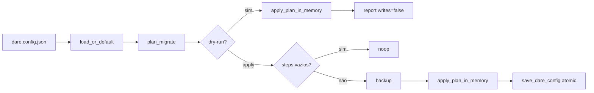

# DESIGN: Configuração e migrations (Microplano 008)

> **Versão:** v1.1 | **Data:** 2026-07-21 | **Status:** APPROVED  
> **Fonte:** `DARE-RUST-MICRO-PLANOS/008-configuracao-e-migrations.md`  
> **Referência:** Microplano 007 (`DareConfig`) · Documento Mestre §13 · ADR-002 · `disk-and-json-policy.md` · DEC-009  
> **Posição:** 8 de 56  
> **Arquivo:** `DARE/DESIGN-008-configuracao-e-migrations.md` (não substitui Designs 001–007)

---

## 1. DESCRIÇÃO

Este Design cobre o **domínio de configuração efetiva** e **migrations controladas** de `dare.config.json` na crate `dare-config`. O microplano 007 entregou o contrato tipado (`DareConfig`, flatten, I/O atómico via `dare-contracts`); o 008 compõe defaults, ficheiro, variáveis de ambiente allowlisted e overrides de CLI numa configuração **efetiva** validada, e expõe um pipeline de migration com **dry-run sem escrita**, **backup antes de apply** e **schemaVersion** apenas quando explicitamente autorizado.

A entrega é uma biblioteca Rust reutilizável pelos comandos de produto (009+, `dare init`, `dare update`, etc.): precedência determinística **CLI > env > file > default**, validação opt-in para blocos com `enabled: false`, preservação de chaves desconhecidas (raiz e nested via flatten), mensagens de erro com **JSON Pointer** (RFC 6901) apontando o campo exacto, e paridade observável com o baseline TypeScript **3.18.1** onde aplicável (classificação Classe A/B/C).

Quem consome são engenheiros dos ciclos 009–056 e agentes de execução; o utilizador final ganha configs legadas que carregam sem perda, migrations previsíveis e diagnósticos acionáveis — sem reescritas silenciosas nem perda de extensões customizadas.

---

## 2. OBJETIVOS E MÉTRICAS DE SUCESSO

| # | Objetivo | Métrica verificável | Meta |
|---|----------|---------------------|------|
| O-01 | Precedência determinística | Matriz P1–P5 + B1–B3 (CLI/env/file/default) | 100% casos MUST verdes |
| O-02 | Config legada sem perda | Fixtures `legacy.config.json` + extras round-trip | 100% chaves unknown preservadas |
| O-03 | Blocos opt-in `enabled: false` | `guard`/`graph`/… com `enabled:false` passam validate sem deep check | 0 falsos positivos MUST |
| O-04 | Dry-run zero-write | `dry_run_migrate` não altera bytes em disco | Assert bit-igual pré/pós |
| O-05 | Apply seguro | `apply_migrate` cria backup em `.dare/backups/` antes de gravar | ≥ 1 backup por apply com steps |
| O-06 | Schema version controlado | `schemaVersion` só aparece com `write_schema_version: true` | Default ausente; opt-in explícito |
| O-07 | Diagnóstico por path JSON | Erros `CoreError::Config` incluem pointer (`/ide`, `/env/DARE_*`, …) | 100% erros de validação MUST |
| O-08 | Paridade TS 3.18.1 | Golden / fixtures comparáveis | Divergências classificadas (DEC-009) |
| O-09 | Ralph Loop | `cargo fmt --check`, `cargo clippy`, `cargo test` | 0 falhas |
| O-10 | Desbloquear 009 | Checklist MUST do 008 fechado | 100% MUST |

---

## 3. STAKEHOLDERS

| Papel | Nome / Time | Interesse principal |
|-------|-------------|---------------------|
| Product Owner | DARE Labs / Dewtech | Paridade de comportamento com CLI npm |
| Tech Lead | Time DARE CLI Rust | Precedência, migrations, DEC-009 |
| Engenheiro CLI | Time implementação | API estável `dare-config` para comandos |
| Usuário Final | Devs / agentes | Config customizada não apagada; erros claros |
| Compatibilidade | Tech Lead | Matriz Classe A; ADR-002 flatten |
| Segurança | Tech Lead + AppSec | Path jail (005), cap 2 MiB, redact secrets |
| Operações | CI 003 | Gates determinísticos multi-OS |

---

## 4. REQUISITOS FUNCIONAIS

| ID | Requisito | Prioridade | Critério de aceite |
|----|-----------|------------|--------------------|
| RF-01 | Precedência **CLI > env > file > default** | MUST | `merge_layers` + testes P1–P5; CLI vence env; env vence file; file vence default |
| RF-02 | Defaults canónicos | MUST | `default_config()` alinhado a `DareConfig::default()` (007); sem ide/blocos por omissão |
| RF-03 | Carregar ficheiro opcional | MUST | `load_effective`: `NotFound` → só defaults+overrides; JSON malformado → `CoreError::Config` |
| RF-04 | Overrides de env allowlisted | MUST | `DARE_IDE`, `DARE_{PROJECT,AGENT,GUARD,GRAPH,HOOKS}_ENABLED`; chaves desconhecidas ignoradas |
| RF-05 | Overrides de CLI | MUST | `CliOverrides { ide, block_enabled, .. }` com mesma semântica que env |
| RF-06 | Merge profundo de blocos | MUST | `project`/`agent`/`guard`/`graph`/`hooks`: merge `enabled` + extras nested; CLI/env sobrescrevem file |
| RF-07 | Preservar unknown keys | MUST | Raiz (`extra` flatten) e nested (`ConfigObject.extra`) sobrevivem load→merge→validate→save |
| RF-08 | Validar config efetiva | MUST | `validate(&cfg)` após merge; `/ide` non-empty se presente |
| RF-09 | Opt-in `enabled: false` | MUST | Blocos com `enabled: false` **não** exigem validação profunda de subcampos (skip deep) |
| RF-10 | Erros com JSON Pointer | MUST | Mensagens tipo `invalid dare.config.json at /ide: …` ou `/env/DARE_GUARD_ENABLED: …` |
| RF-11 | Migration plan | MUST | `plan_migrate` produz `MigrationPlan { steps, from_fingerprint, … }` determinístico |
| RF-12 | Dry-run migration | MUST | `dry_run_migrate` retorna `MigrateDryRunReport { before, after, writes: false }`; **zero** I/O de escrita |
| RF-13 | Apply migration | MUST | `apply_migrate`: se steps não vazios e ficheiro existia → `backup` + `save_dare_config` atómico |
| RF-14 | Schema version opt-in | MUST | `schemaVersion` em `extra` só com `MigrateOptions.write_schema_version == true` |
| RF-15 | Fingerprint de origem | MUST | `from_fingerprint` SHA-256 do JSON canónico pré-migration (audit trail) |
| RF-16 | API pública documentada | MUST | `docs/compatibility/config-and-migrations.md` + DEC-009 no decision log |
| RF-17 | Fixtures golden | MUST | `legacy`, `with_extras`, `enabled_false` em `crates/dare-config/tests/fixtures/` |
| RF-18 | Env strict mode | SHOULD | `env_overrides_from_vars_strict` rejeita bool inválido com pointer `/env/{KEY}` |
| RF-19 | Steps tipados extensíveis | SHOULD | `MigrationStepKind`: `Noop`, `SetEnabled`, `WriteSchemaVersion` — novos kinds via ADR |
| RF-20 | CLI `dare config` / `dare migrate` | COULD | **Fora deste ciclo** — expostos em microplanos de comando (016+, 022) |
| RF-21 | Validação Zod-parity completa | COULD | Deep validation de todos os blocos — defer para comandos que consumem cada bloco |
| RF-22 | Rollback automático pós-falha | COULD | Restore a partir de backup — manual ou 022-update |

> Prioridades: **MUST** · **SHOULD** · **COULD**

### Precedência (matriz de aceite)

| ID | Cenário | Resultado esperado |
|----|---------|-------------------|
| P1 | env.ide + file.ide | env vence |
| P2 | cli.ide + file.ide | cli vence |
| P3 | cli.ide + env.ide + file.ide | cli vence |
| P4 | sem file/env/cli | defaults (ide ausente) |
| P5 | só file.ide | file vence |
| B1 | file guard enabled:false + env true | env habilita guard |
| B2 | env false + cli true em guard | cli vence |
| B3 | extras no file | preservados após merge |

Ordem de composição interna: `defaults ← file ← env ← cli` (última camada ganha).

### Allowlist de variáveis de ambiente

| Variável | Efeito | Valores |
|----------|--------|---------|
| `DARE_IDE` | override `/ide` | string non-empty |
| `DARE_GUARD_ENABLED` | `/guard/enabled` | true/false/1/0/yes/no/on/off |
| `DARE_GRAPH_ENABLED` | `/graph/enabled` | idem |
| `DARE_AGENT_ENABLED` | `/agent/enabled` | idem |
| `DARE_HOOKS_ENABLED` | `/hooks/enabled` | idem |
| `DARE_PROJECT_ENABLED` | `/project/enabled` | idem |

### Contrato de disco (este ciclo)

| Path | Papel |
|------|-------|
| `dare.config.json` | Config persistida — leitura/escrita via `dare-contracts` |
| `.dare/backups/` | Cópias timestamped antes de `apply_migrate` (005 `backup`) |

Alteração de schema/ID/exit ⇒ ADR + migration note (`disk-and-json-policy.md`).

---

## 5. REQUISITOS NÃO-FUNCIONAIS

| ID | Categoria | Requisito | Meta |
|----|-----------|-----------|------|
| RNF-01 | Compatibilidade | Leitura de config legada npm 3.18.1 | Fixtures green ou classificadas |
| RNF-02 | Determinismo | Mesma precedência em Linux/macOS/Windows | CI matrix verde |
| RNF-03 | Performance | `load_effective` + validate em config típica (< 50 KiB) | < 10 ms orientativo (SSD) |
| RNF-04 | Performance | `dry_run_migrate` | < 20 ms orientativo |
| RNF-05 | Observabilidade | Erros via `CoreError::Config` + pointer; sem dump de env secrets | Redact em logs |
| RNF-06 | Manutenibilidade | Módulos separados: `defaults`, `load`, `merge`, `env`, `override`, `validate`, `migrate` | Clippy limpo; sem `unwrap` em prod |
| RNF-07 | Dependências | `dare-core`, `dare-contracts`, `serde_json`, `sha2` (fingerprint) | `cargo audit` + deny verdes |
| RNF-08 | Integridade | Gravação atómica via `write_json_atomic` (007/005) | Sem ficheiros parciais |
| RNF-09 | Limites | Cap 2 MiB na leitura (contracts `read_limited`) | Rejeitar oversized com erro tipado |

---

## 6. REQUISITOS DE SEGURANÇA

| ID | Requisito | Referência |
|----|-----------|------------|
| RS-01 | Validar entradas (env allowlist, bools, ide non-empty) antes de efeitos | OWASP A03 |
| RS-02 | Não logar valores de env que possam conter tokens; redact em mensagens de erro | OWASP A02 |
| RS-03 | Toda leitura/escrita/backup sob `ProjectRoot` + `SafeRelativePath` (005) | OWASP A01 |
| RS-04 | `cargo audit` + `cargo deny` após alteração de deps | OWASP A06 |
| RS-05 | Sem secrets hardcoded; overrides sensíveis só via env documentado ou ficheiro local | Supply chain |
| RS-06 | Não executar conteúdo JSON como código; migration steps são dados tipados | Injection |
| RS-07 | Cap 2 MiB no reader (007) — rejeitar ficheiros oversized | DoS |
| RS-08 | Backup antes de apply; write atómico; falha parcial não corrompe original sem backup | Integridade |
| RS-09 | Sem shell concatenado; se spawn de processos for necessário no futuro → argv separado | Command injection |
| RS-10 | Dry-run **nunca** escreve — impedir side-effects acidentais em CI/agentes | Defense in depth |

---

## 7. STACK TÉCNICA

| Camada | Tecnologia | Versão |
|--------|-----------|--------|
| Rust | toolchain pin | 1.85.0 (workspace) |
| Workspace | `dare-cli` | `0.1.0-alpha.0` |
| Crate alvo | `dare-config` | workspace member |
| Contrato config | `dare-contracts` (`DareConfig`, I/O) | microplano 007 |
| Erros / path / fs / JSON canónico | `dare-core` | microplanos 004+005 |
| Serialização | `serde` + `serde_json` | pins workspace |
| Fingerprint migration | `sha2` | workspace pin |
| Testes | `tempfile`, fixtures locais, `tests/precedence.rs` | — |
| Baseline referência | CLI npm DARE | 3.18.1 (paridade observável) |

---

## 8. INTEGRAÇÕES EXTERNAS

| Sistema | Tipo | Protocolo | Direção | Dados trocados | Responsável |
|---------|------|-----------|---------|----------------|-------------|
| Filesystem local | I/O | OS | Entrada+saída | `dare.config.json`, backups | Time CLI |
| Variáveis de ambiente | Override | `DARE_*` allowlist | Entrada | ide, enabled flags | Runtime OS |
| `dare-contracts` | Biblioteca | API Rust | Entrada | `DareConfig`, load/save | Crate 007 |
| `dare-core` | Biblioteca | API Rust | Entrada | `ProjectRoot`, `CoreError`, `backup` | Crate 005 |
| Baseline TS 3.18.1 | Referência | fixtures | Entrada | Golden comportamento config | Compat |
| CI 003 | Test | GHA | Entrada | Suite multi-OS | Time CLI |
| Microplano 009+ | Consumidor | API Rust | Saída | `load_effective`, migrate | Comandos produto |

---

## 9. RESTRIÇÕES

- **Pré-requisitos:** Microplano **007** DONE (`DareConfig`, readers/writers, flatten).
- **Dependências arquitecturais:** `dare-config` → `dare-contracts` → `dare-core`; **sem** ciclos.
- **Prazo:** Bloqueia **009** (assets) e qualquer comando que resolva config efetiva.
- **Limitações:**
  - Não implementar subcomandos CLI `dare config` / `dare migrate` neste ciclo (só biblioteca).
  - Não alterar shape público de `DareConfig` sem ADR (007).
  - Não reescrever configs legadas silenciosamente — migration explícita com dry-run.
  - `schemaVersion` nunca escrito por default (DEC-009).
  - Mensagens de erro en-US; documentação técnica pt-BR.
- **Breaking:** mudança de precedência, allowlist env ou exit code ⇒ ADR + migration note + teste compat.

---

## 10. FORA DO ESCOPO (v1)

- Microplano **009** — inventário e empacotamento de assets (`dare-assets`).
- Comandos CLI de produto que **invocam** migrate (`dare update`, 022).
- Validação profunda de conteúdo de cada bloco (guard rules, graph limits, hooks registry).
- Migrations multi-ficheiro (DAG, state, skills) — cada artefato no seu microplano.
- Servidor remoto de config / feature flags cloud.
- Watch mode / hot-reload de config.
- Criptografia at-rest de `dare.config.json`.
- SQLite / GraphRAG (040+).

---

## 11. RISCOS E MITIGAÇÕES

| # | Risco | Probabilidade | Impacto | Mitigação |
|---|-------|---------------|---------|-----------|
| R-01 | Precedência diverge do TS/npm | Média | Alto | Matriz P/B + golden; DEC-009; classificar divergências |
| R-02 | Perda de unknown keys no merge | Média | Alto | Testes `with_extras`; flatten ADR-002; round-trip asserts |
| R-03 | Migration apply sem backup | Baixa | Alto | `backup()` obrigatório se ficheiro existia; teste integração |
| R-04 | Dry-run com side-effect acidental | Baixa | Alto | `writes: false` no report; assert bytes iguais; code review |
| R-05 | Env vars não documentadas vazam comportamento | Média | Médio | Allowlist fechada; unknown keys ignoradas |
| R-06 | `schemaVersion` escrito sem consentimento | Média | Médio | Flag explícita; default false; doc + teste |
| R-07 | Mensagens de erro sem pointer | Média | Médio | Convenção `/campo` e `/env/VAR`; testes de string |
| R-08 | Ciclo config ↔ contracts | Baixa | Alto | Dependência unidireccional; contracts não importa config |
| R-09 | Cap 2 MiB insuficiente para edge cases | Baixa | Baixo | Documentar limite; erro claro; ADR se subir |

---

## 12. CHECKLIST DE APROVAÇÃO

- [x] RF-01…RF-22 priorizados (CLI comandos / deep validation fora)
- [x] Precedência CLI > env > file > default aceite (DEC-009)
- [x] Allowlist `DARE_*` fechada e documentada
- [x] Política `schemaVersion` opt-in aceite
- [x] Dry-run zero-write e backup-before-apply aceites
- [x] JSON Pointer em erros de validação aceite
- [x] RS-01…RS-10 validados
- [x] Pré-requisito 007 confirmado
- [x] Pronto para `/dare-blueprint` → `DARE/BLUEPRINT-008-configuracao-e-migrations.md`
- [x] Loop autónomo 008–010: design refeito com status **APPROVED**

---

## Apêndice A — Crates / paths (microplano)

| Path | Papel |
|------|-------|
| `crates/dare-config/src/defaults.rs` | Defaults canónicos |
| `crates/dare-config/src/load.rs` | `load_effective` |
| `crates/dare-config/src/merge.rs` | Precedência e deep merge |
| `crates/dare-config/src/env.rs` | Parse `DARE_*` |
| `crates/dare-config/src/override.rs` | `CliOverrides` / `EnvOverrides` |
| `crates/dare-config/src/validate.rs` | Validação + JSON Pointer |
| `crates/dare-config/src/migrate.rs` | Plan, dry-run, apply, backup |
| `crates/dare-config/tests/fixtures/` | Golden legado |
| `crates/dare-config/tests/precedence.rs` | Matriz P/B |
| `docs/compatibility/config-and-migrations.md` | Doc de compatibilidade |

## Apêndice B — API pública mínima

```text
default_config()
merge_layers(defaults, file, env, cli)
validate(cfg)
load_effective(root, rel, env, cli)
env_overrides_from_vars / env_overrides_from_vars_strict / env_overrides_from_os
plan_migrate / dry_run_migrate / apply_migrate / apply_plan_in_memory
MigrateOptions, MigrationPlan, MigrationStep, MigrateDryRunReport
CliOverrides, EnvOverrides
```

## Apêndice C — Fluxo de migration



## Apêndice D — Próximas etapas

1. ~~Revisar e aprovar este Design~~ (APPROVED — loop autónomo).  
2. `/dare-blueprint` → `DARE/BLUEPRINT-008-configuracao-e-migrations.md` (refazer se necessário).  
3. `/dare-execute` microplano 008 com Ralph Loop.  
4. Após closeout → [`009-inventario-e-empacotamento-de-assets.md`](../DARE-RUST-MICRO-PLANOS/DARE-RUST-MICRO-PLANOS/009-inventario-e-empacotamento-de-assets.md).
