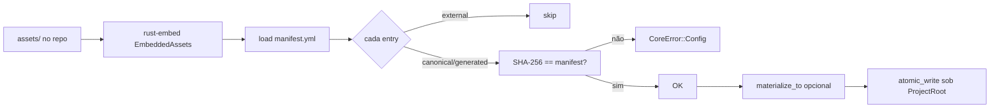

# DESIGN: Inventário e empacotamento de assets (Microplano 009)

> **Versão:** v1.0 | **Data:** 2026-07-21 | **Status:** DRAFT  
> **Fonte:** `DARE-RUST-MICRO-PLANOS/009-inventario-e-empacotamento-de-assets.md`  
> **Referência:** Microplanos 001–008 · Doc Mestre · DEC-010 · `disk-and-json-policy.md` · baseline TS 3.18.1  
> **Posição:** 9 de 56  
> **Arquivo:** `DARE/DESIGN-009-inventario-e-empacotamento-de-assets.md` (não substitui Designs 001–008)  
> **Nota:** Existe implementação parcial em `crates/dare-assets` + `assets/` — este Design formaliza o contrato MUST e gaps a fechar no Blueprint (inventário completo, classificação, CI fail-on-mismatch, docs).

---

## 1. DESCRIÇÃO

Este Design cobre o **inventário, classificação, empacotamento e verificação** dos assets DARE (templates, rules, commands, skills e artefactos relacionados) na crate `dare-assets`. O problema: o CLI TypeScript 3.18.1 espalha fontes editáveis (`templates/`, `implementations/`, skills IDE) sem um manifesto único com integridade; o rewrite Rust precisa de uma **fonte canónica** embutida no binário, verificável por SHA-256, materializável sem Node.

A entrega é: diretório `assets/` + `assets/manifest.yml` (versão 1), embed via **rust-embed**, API `verify_embedded_assets` / `materialize_to` sob path jail (005), comando CLI `dare assets verify`, e classificação explícita **canonical | generated | external**. Quem consome são microplanos 010+ (capabilities, harness adapters, init/update): o utilizador final obtém instalação íntegra e materialização offline.

---

## 2. OBJETIVOS E MÉTRICAS DE SUCESSO

| # | Objetivo | Métrica verificável | Meta |
|---|----------|---------------------|------|
| O-01 | Inventário classificado | Todo asset da baseline no escopo tem `kind` no manifest | 100% |
| O-02 | Integridade SHA-256 | `verify_embedded_assets` falha se missing ou hash ≠ manifest | 100% falhas tipadas |
| O-03 | Embed no binário | Assets acessíveis via `EmbeddedAssets` sem FS externo | Build OK |
| O-04 | Materialização sem Node | `materialize_to` escreve sob `ProjectRoot` | ≥ 1 ficheiro + teste |
| O-05 | Single source of truth | Templates canónicos sob `assets/`; sem segunda cópia editável “oficial” | DEC-010 |
| O-06 | CLI verify | `dare assets verify` exit 0 no happy path | Smoke |
| O-07 | Ralph Loop | `cargo fmt --check`, clippy, test | 0 falhas |
| O-08 | Paridade / classificação | Divergências vs TS 3.18.1 documentadas Classe A/B/C | DEC-010 |
| O-09 | Desbloquear 010 | Checklist MUST 009 fechado | 100% MUST |

---

## 3. STAKEHOLDERS

| Papel | Nome / Time | Interesse principal |
|-------|-------------|---------------------|
| Product Owner | DARE Labs / Dewtech | Assets íntegros no binário alpha |
| Tech Lead | Time DARE CLI Rust | Manifest, rust-embed, DEC-010 |
| Engenheiro CLI | Time implementação | API `dare-assets` para 010–056 |
| Usuário Final | Devs / agentes | `dare assets verify`; materialização offline |
| Compatibilidade | Tech Lead | Inventário vs pacote npm 3.18.1 |
| Segurança | Tech Lead + AppSec | Hash, path jail, sem secrets em assets |
| Operações | CI 003 | Gate verify no build/test |

---

## 4. REQUISITOS FUNCIONAIS

| ID | Requisito | Prioridade | Critério de aceite |
|----|-----------|------------|--------------------|
| RF-01 | Diretório `assets/` na raiz do workspace | MUST | Contém `manifest.yml` + paths referenciados |
| RF-02 | Manifest YAML v1 | MUST | Campos: `version: 1`, `assets[]` com `id`, `path`, `sha256`, `kind` |
| RF-03 | Kinds: `canonical` \| `generated` \| `external` | MUST | Enum tipado; `external` **não** exigido no embed verify |
| RF-04 | SHA-256 hex lowercase | MUST | `sha256_hex(bytes)` bate com manifest |
| RF-05 | Embed com rust-embed | MUST | `#[folder = "../../assets"]` (ou path equivalente estável); pin **8.7.2** |
| RF-06 | `verify_embedded_assets()` | MUST | Missing → erro; mismatch → erro; external skipped |
| RF-07 | `materialize_to(root, dest_rel)` | MUST | Verify primeiro; `atomic_write` por ficheiro; retorna count |
| RF-08 | Inventariar templates DARE | MUST | Pelo menos templates canónicos DESIGN/BLUEPRINT/TASKS/TASK-SPEC/TELEMETRY/HOOKS (+ outros acordados no Blueprint) |
| RF-09 | Classificar `.claude`/IDE editáveis | MUST | `external` ou fora do manifest — **não apagar** cópias do utilizador (DEC-010) |
| RF-10 | Eliminar fonte duplicada “oficial” | MUST | Política: editar em `assets/`; `templates/` raiz = espelho ou legado documentado (Blueprint fecha) |
| RF-11 | CLI `dare assets verify` | MUST | Help lista; exit 0 / exit Config se falhar |
| RF-12 | Docs + DEC-010 | MUST | `docs/compatibility/assets-inventory.md` + decision log |
| RF-13 | Teste verify no crate | MUST | `verify_embedded_ok` no CI |
| RF-14 | Script/regen hashes | SHOULD | Doc ou script para regenerar `sha256` após editar asset |
| RF-15 | Inventário completo TS (`implementations/**`) | SHOULD | Tabela no doc; entries no manifest ou `external` explícito |
| RF-16 | Fail CI se manifest desatualizado | SHOULD | Job ou teste que recomputa hashes do FS `assets/` |
| RF-17 | `include_dir` alternativo | COULD | Fora — rust-embed é a escolha DEC-010 |
| RF-18 | CDN / download remoto de assets | COULD | Fora — só embed |

> Prioridades: **MUST** · **SHOULD** · **COULD**

### Contrato de disco

| Path | Papel |
|------|-------|
| `assets/manifest.yml` | Inventário + hashes |
| `assets/**` | Bytes canónicos / gerados embutidos |
| `templates/**` (raiz) | Legado TS / espelho — política no Blueprint |
| `.dare/assets/` (destino tipico) | Materialização via `materialize_to` |
| `.claude/commands` etc. | **external** — não apagar neste ciclo |

### API pública mínima

```text
AssetKind { Canonical, Generated, External }
AssetEntry { id, path, sha256, kind }
AssetsManifest { version, assets }
sha256_hex / load_manifest_from_str
EmbeddedAssets (rust-embed)
verify_embedded_assets() -> CoreResult<()>
materialize_to(root, dest_rel) -> CoreResult<usize>
```

---

## 5. REQUISITOS NÃO-FUNCIONAIS

| ID | Categoria | Requisito | Meta |
|----|-----------|-----------|------|
| RNF-01 | Determinismo | Paths POSIX no manifest (`templates/...`) | Cross-OS verify |
| RNF-02 | Performance | Verify de dezenas de assets | < 100 ms tipicamente |
| RNF-03 | Compatibilidade | Win/macOS/Linux | CI matrix 003 |
| RNF-04 | Observabilidade | Erros `CoreError::Config` com path do asset | Mensagem acionável |
| RNF-05 | Manutenibilidade | Módulos `manifest` / `embed` / `verify` / `materialize` | Clippy limpo |
| RNF-06 | Dependências | `rust-embed=8.7.2`, `sha2`, `serde_yaml`, `dare-core` | audit + deny |
| RNF-07 | Integridade | Materialize só após verify OK | Sem writes parciais de set corrompido |
| RNF-08 | Tamanho binário | Assets embutidos rastreados | Doc tamanho orientativo |

---

## 6. REQUISITOS DE SEGURANÇA

| ID | Requisito | Referência |
|----|-----------|------------|
| RS-01 | Validar paths do manifest (relativos, sem `..` escape) antes de materializar | OWASP A03 / path safety 005 |
| RS-02 | Assets não devem conter secrets/tokens; scan/revisão no inventário | OWASP A02 |
| RS-03 | Toda escrita via `ProjectRoot` + `SafeRelativePath` + `atomic_write` | OWASP A01 / 005 |
| RS-04 | `cargo audit` + `cargo deny` após deps | OWASP A06 |
| RS-05 | Sem secrets hardcoded no código ou manifest | Supply chain |
| RS-06 | Não executar conteúdo de assets como código no verify | Injection |
| RS-07 | Hash mismatch = falha hard (não warning silencioso) | Integridade |
| RS-08 | `external` nunca sobrescrito por `materialize_to` neste ciclo | Preservar customizações |
| RS-09 | Sem shell para hashing — `sha2` in-process | Command injection |
| RS-10 | Cap implícito: assets de tamanho razoável; oversized documentado se necessário | DoS |

---

## 7. STACK TÉCNICA

| Camada | Tecnologia | Versão |
|--------|-----------|--------|
| Rust | toolchain | **1.85.0** |
| Workspace | `dare-cli` | `0.1.0-alpha.0` |
| Crate | `dare-assets` | workspace |
| Embed | `rust-embed` | **=8.7.2** |
| Hash | `sha2` | pin workspace |
| YAML | `serde_yaml` (`yaml_serde` 0.10.4) | workspace |
| Path / FS | `dare-core` | 005 |
| CLI | `dare-cli` subcomando `assets verify` | clap |
| Baseline | npm `@dewtech/dare-cli` | **3.18.1** |

---

## 8. INTEGRAÇÕES EXTERNAS

| Sistema | Tipo | Protocolo | Direção | Dados | Responsável |
|---------|------|-----------|---------|-------|-------------|
| Filesystem | I/O | OS | In/Out | `assets/`, materialize dest | Time CLI |
| rust-embed | Build | compile-time | In | bytes de `assets/` | Crate 009 |
| Baseline TS 3.18.1 | Referência | inventário | In | lista templates/skills | Compat |
| CI 003 | Test | GHA | In | `verify` + tests | Time CLI |
| Microplano 010+ | Consumidor | API Rust | Out | embed + matrix | Adapters |

---

## 9. RESTRIÇÕES

- **Pré-requisitos:** 001–002 (workspace); **007–008** recomendados (contracts/config); path safety **005**.
- **Dependências:** `dare-assets` → `dare-core`; **sem** ciclo com `dare-config`.
- **Bloqueia:** 010 (capabilities no embed), 011+ harness, init/update que materializam assets.
- **Limitações:**
  - Não implementar sync completo IDE (011–014) neste ciclo — só inventário/embed/verify.
  - Não apagar `.claude` do utilizador.
  - Mensagens CLI en-US; docs pt-BR.
- **Breaking:** mudança de `manifest.version`, kind names ou path canónico ⇒ ADR + migration note.

---

## 10. FORA DO ESCOPO (v1)

- Microplano **010** — modelo canónico de capabilities (pode *habitar* `assets/capability-matrix.yml`, mas validação profunda é 010).
- Adapters harness Claude/Cursor/Codex/Antigravity (011–014).
- `dare update` / publish de assets remotos.
- CDN, S3, signed remote manifests.
- `include_dir` em vez de rust-embed.
- UI de inventário / dashboard.

---

## 11. RISCOS E MITIGAÇÕES

| # | Risco | Probabilidade | Impacto | Mitigação |
|---|-------|---------------|---------|-----------|
| R-01 | Hash desatualizado após edit | Alta | Alto | Script regen + teste SHOULD RF-16 |
| R-02 | Duplicata `templates/` vs `assets/templates/` | Alta | Médio | Política DEC-010 no Blueprint |
| R-03 | Inventário incompleto vs npm | Média | Médio | Tabela Classe B/C no doc |
| R-04 | Binário inchado | Baixa | Médio | Só canónicos necessários; medir |
| R-05 | Materialize sobrescreve custom | Média | Alto | Skip `external`; dest sob `.dare/` |
| R-06 | Path traversal no manifest | Baixa | Alto | `SafeRelativePath` rejeita `..` |
| R-07 | Secrets em template legado | Baixa | Alto | Review no inventário (RS-02) |

---

## 12. CHECKLIST DE APROVAÇÃO

- [ ] RF-01…RF-18 priorizados (CDN/`include_dir` fora)
- [ ] Kinds canonical/generated/external aceites
- [ ] rust-embed 8.7.2 + SHA-256 aceite (DEC-010)
- [ ] Política de não apagar `.claude` aceite
- [ ] Política `templates/` raiz vs `assets/` a fechar no Blueprint
- [ ] RS-01…RS-10 validados
- [ ] Pré-requisitos 005/007–008 OK
- [ ] Pronto para `/dare-blueprint` → `DARE/BLUEPRINT-009-inventario-e-empacotamento-de-assets.md`

---

## Apêndice A — Crates / paths

| Path | Papel |
|------|-------|
| `crates/dare-assets/src/manifest.rs` | Tipos + SHA-256 |
| `crates/dare-assets/src/embed.rs` | `EmbeddedAssets` |
| `crates/dare-assets/src/verify.rs` | `verify_embedded_assets` |
| `crates/dare-assets/src/materialize.rs` | `materialize_to` |
| `assets/manifest.yml` | Inventário |
| `assets/templates/**` | Templates canónicos |
| `docs/compatibility/assets-inventory.md` | Compat |

## Apêndice B — Fluxo verify / materialize



## Apêndice C — Estado atual (gap hint)

| Item | Estado observado |
|------|------------------|
| Crate + embed + verify + materialize | Parcialmente implementado |
| Manifest com templates + capability-matrix | Presente |
| Docs / DEC-010 | Presentes (podem expandir) |
| Inventário completo TS / regen CI | Gaps típicos para Blueprint |
| Política espelho `templates/` | A fechar |

## Apêndice D — Próximas etapas

1. Revisar e aprovar este Design.  
2. `/dare-blueprint` → `BLUEPRINT-009-…`.  
3. `/dare-tasks` → DAG `mp009-*`.  
4. Após closeout → [`010-modelo-canonico-de-capabilities.md`](../DARE-RUST-MICRO-PLANOS/DARE-RUST-MICRO-PLANOS/010-modelo-canonico-de-capabilities.md).
