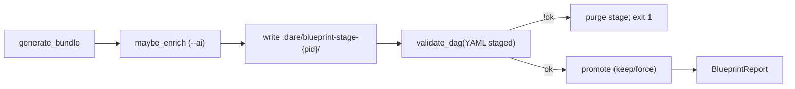
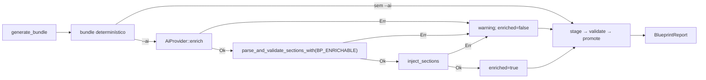

# CLI: `dare blueprint` (Ciclo 025)

Geração **determinística** de `DARE/BLUEPRINT.md`, `DARE/TASKS.md`, `DARE/dare-dag.yaml` e specs em `DARE/EXECUTION/` a partir de um Design existente; enrichment opcional por IA só em `BLUEPRINT.md` via crate **`dare-ai`** (024). Complementa [DEC-026](../DECISION-LOG.md) (025). Blueprint 025.

Source: `crates/dare-cli/src/commands/blueprint.rs` · `crates/dare-dag/` · `crates/dare-ai/`

## Command

```bash
dare blueprint
dare blueprint DARE/DESIGN-025-blueprint.md
dare blueprint --force
dare blueprint --json
dare blueprint --ai
dare blueprint --ai --provider mock
dare blueprint DARE/DESIGN.md --force --ai --provider codex --json
```

| Flag / arg | Efeito |
|------------|--------|
| `[design]` | Path opcional ao ficheiro Design (**input**). Default: `DARE/DESIGN.md`. Resolvido sob `ProjectRoot` (jail). |
| `--force` | Sobrescreve artefactos existentes **mesmo sem** marker managed (inclui customizações unmanaged). |
| `--json` | Envelope JSON (004); `data` = `BlueprintReport` schema **1** |
| `--no-color` | Sem ANSI (global 004) |
| `--ai` | Após `generate_bundle`, invoca provider para enriquecer secções AGENT em `BLUEPRINT.md` |
| `--provider <id>` | Provider explícito; **requer** `--ai`. Valores: `mock` \| `codex` \| `claude-code` \| `cursor-cli` \| `antigravity-cli` |

### Regras de uso

| Condição | Resultado |
|----------|-----------|
| `provider.is_some() && !ai` | Usage exit **2** — `"--provider requires --ai"` |
| project root não encontrado | InvalidInput exit **4** |
| Design path ausente | NotFound exit **3** |
| Design vazio após trim | InvalidInput exit **4** |
| `design.len() > DESIGN_READ_CAP` (262 144) | InvalidInput exit **4** |
| artefacto gerado `> ARTIFACT_WRITE_CAP` (1 048 576) | InvalidInput exit **4** |
| path jail / escape | InvalidInput exit **4** |
| provider id desconhecido | InvalidInput exit **4** — `"unknown provider: …"` |
| provider não implementado (`claude-code`, `cursor-cli`, `antigravity-cli`) | InvalidInput exit **4** — `"provider not implemented: …"` |
| `validate_dag` falha no bundle staged | Internal/validate exit **1**; staging purgado; `validation` embutido no report |
| falha de I/O em stage/promote | Io exit **5** |

### Default provider

| Contexto | Provider |
|----------|----------|
| Sem `--ai` | N/A — pipeline determinístico puro |
| `--ai` sem `--provider` | **`codex`** (produto / dev local) |
| CI / testes | **`mock`** explicitamente (`--ai --provider mock`) |

## Paths canónicos

| Path | Semântica |
|------|-----------|
| `DARE/DESIGN.md` | Design **default** quando o arg posicional é omitido (`DEFAULT_DESIGN_REL`) |
| `[design]` (arg) | Input alternativo (ex.: `DARE/DESIGN-025-blueprint.md` em monorepo de microplanos). **Só leitura**; outputs **não** seguem o sufixo do input |
| `DARE/BLUEPRINT.md` | Output principal (`OUT_BLUEPRINT`) |
| `DARE/TASKS.md` | Tabela de tasks (`OUT_TASKS`) |
| `DARE/dare-dag.yaml` | Grafo v2.1 (`OUT_DAG`) |
| `DARE/EXECUTION/{task-id}.md` | Spec por task (`OUT_EXEC_DIR`) |
| `.dare/blueprint-stage-{pid}/DARE/…` | Staging temporário (ver § Staging) |

**Contrato congelado:** outputs **sempre** nos paths canónicos acima (paridade Doc Mestre / TS). Multi-output `BLUEPRINT-NNN-*` / `TASKS-NNN-*` no disco do utilizador → **fora de escopo** alpha.

## Managed marker

Detecta artefactos geridos pelo CLI vs customizações do utilizador (sem hash manifest — espírito update keep 022).

| Formato | Marker | Detecção |
|---------|--------|----------|
| Markdown (`.md`) | `<!-- dare:managed -->` | Primeira linha **não vazia** após `trim_start` contém `MANAGED_MD` |
| YAML (`.yaml`) | `# dare:managed` | Primeira linha **não vazia** contém `MANAGED_YAML` |

Constantes: `MANAGED_MD`, `MANAGED_YAML`.

### Política promote (sem `--force`)

| Destino existe? | Managed? | Ação |
|-----------------|----------|------|
| não | — | `atomic_write` → `written` |
| sim | sim | `atomic_write` → `written` |
| sim | não | **keep** — skip write; path em `kept`; warning |

Com `--force`: sempre `atomic_write` todos os destinos do bundle (inclui unmanaged).

Artefactos gerados incluem o marker na **primeira linha útil** (`BLUEPRINT.md`, `TASKS.md`, cada `EXECUTION/*.md`, prefixo YAML do DAG).

## Staging

Pipeline **stage-then-validate-then-promote** — nunca deixa `dare-dag.yaml` inválido como único artefacto live (RF-10 / R-03).



| Passo | Ação |
|-------|------|
| 1 | `stage_dir = .dare/blueprint-stage-{pid}/DARE/…` espelha outputs |
| 2 | Escreve bundle completo no stage (force implícito no stage) |
| 3 | Parse YAML staged → `dare_dag::validate_dag` (`strict: false`) |
| 4 | Se `!report.ok` → Err; **não** promote; purge stage best-effort; CLI exit **1** com `validation` no JSON |
| 5 | Se ok → `promote` por ficheiro (política managed acima) |
| 6 | Purge stage best-effort |
| 7 | Opcional pós-promote: `validate_path(DARE/dare-dag.yaml)`; falha rara → Internal exit **1** + warning (ficheiros já escritos — staging reduz risco) |

Escritas live sob `DARE/` via `atomic_write` (`dare-core` / RS-03).

## Heurística determinística (Design → tasks)

Sem LLM obrigatório (RNF-01). Algoritmo fixo §5.4 Blueprint 025:

**Sempre emitir (rank 0 — deps vazias):**

| id | title | depends_on | complexity |
|----|-------|------------|------------|
| `task-001` | Verify docker-compose / container baseline | `[]` | LOW |
| `task-002` | Implement core from design | `[]` | MED |

**Por cada RF-MUST** no Design (prioridade MUST na tabela RF; máx **8**; ordem estável do ficheiro):

- `task-{003+i}` · title = `RF-xx: {requisito trunc 60}` · `depends_on: ["task-002"]` · `complexity: MED`

Extração: `extract_must_requirements(design)` — linhas da tabela RF com célula de prioridade MUST → `(id, requisito)`.

**Sempre no fim:**

| id | title | depends_on | complexity |
|----|-------|------------|------------|
| `task-audit` | Ralph audit fmt/clippy/test | todos os ids anteriores excepto `task-close` | MED |
| `task-close` | Closeout checklist | `["task-audit"]` | LOW |

**Outros contratos:**

- `subtask_prompt`: en-US, self-contained, ≥ 80 chars, inclui title + `"Follow DARE/BLUEPRINT.md; no git commit."`
- `spec_file`: `EXECUTION/{id}.md`
- `dare-dag.yaml`: bloco `limits` (`parent_context_chars: 2000`, `task_output_chars: 4000`, `timeout_seconds: 600`); bloco `models:` canónico (cursor/claude/antigravity) copiado do template 020
- `BLUEPRINT.md`: título `# BLUEPRINT: {title}`; meta `Status: DRAFT`; secções AGENT nos ids `BP_ENRICHABLE`; anexos copiados do Design (RF/RNF/RS/Stack) quando presentes

Título: `parse_design_title` — primeira linha `^#\s+DESIGN:\s*(.+)` ou primeiro H1; senão `"Untitled"`.

Fixtures: `tests/fixtures/blueprint/` (`sample-design.md`, `golden-dag.yaml`, `golden-tasks-fragment.md`).

## Markers AGENT (BLUEPRINT enrichable)

Delimitação para injeção `--ai` (distinto dos 4 ids ENRICHABLE do `dare design`):

```text
<!-- AGENT:BEGIN section="<id>" -->
<body>
<!-- AGENT:END section="<id>" -->
```

| `section` id | Secção típica |
|--------------|---------------|
| `architecture-overview` | Resumo da descrição Design |
| `execution-phases` | Fases geradas pelas tasks |
| `api-contracts` | Lista RF ids ou stub |
| `data-model` | Tabela RFs stub ou derivada |

Constantes: `BP_ENRICHABLE` — mesmos delimitadores `MARKER_BEGIN` / `MARKER_END_PREFIX` que design 023.

## Enrichment por IA (soft-fail)

**Diferente de `dare design` (024 hard-fail):** falha de provider/schema/inject **não aborta** o bundle determinístico.

### Pipeline



| Fase | Ação | Falha |
|------|------|-------|
| **generate** | `generate_bundle` **sempre** executa | Exit 3/4/5 conforme tabela |
| **enrich** | `EnrichRequest { command: "blueprint", title, description, current_markdown, cwd }` | **Soft-fail:** warning + `enriched=false`; continua com bundle determinístico |
| **validate sections** | `parse_and_validate_sections_with(stdout, BP_ENRICHABLE)` | Soft-fail |
| **inject** | `inject_sections(blueprint_md, sections, BP_ENRICHABLE)` | Soft-fail |
| **stage/validate/promote** | Sempre sobre bundle final (enriched ou não) | Exit 1 se DAG inválido; 5 se I/O |

Schema JSON `sections`: objeto com **4 keys** = `BP_ENRICHABLE`; validação idêntica em espírito ao design 024 (`BODY_MAX`, reject nested AGENT markers).

Timeout / env / caps: herdados de `dare-ai` (DEC-025) — `ENRICH_TIMEOUT` 20 min; `DARE_*_COMMAND` argv-only; `STDOUT_CAP` 1 MiB.

## Exit codes

| Code | Quando |
|------|--------|
| 0 | Sucesso: validate ok; artefactos promovidos (com ou sem `--ai`; `enriched` pode ser `false`) |
| 1 | Validate DAG falhou no staging **ou** Internal (incl. validate pós-promote raro) |
| 2 | Usage (clap; `--provider` sem `--ai`) |
| 3 | NotFound — Design path ausente |
| 4 | InvalidInput (root, Design vazio/oversize, path jail, provider inválido, caps artefacto) |
| 5 | Io (read Design, stage, promote) |

## BlueprintReport schema 1 (congelado)

Campos camelCase em `--json`:

| Field | Type | Notes |
|-------|------|-------|
| `schemaVersion` | number | Always **`1`** |
| `mode` | string | Always `"blueprint"` |
| `ok` | bool | `true` on success (promote concluído; validate ok) |
| `designPath` | string | Path POSIX relativo ao root (ex.: `"DARE/DESIGN.md"`) |
| `force` | bool | Eco da flag CLI |
| `ai` | bool | Eco de `--ai` |
| `provider` | string \| null | Id do provider se `ai`; senão `null` |
| `enriched` | bool | `true` só se inject OK; `false` se `--ai` omitido ou soft-fail |
| `written` | string[] | Paths promovidos nesta run |
| `kept` | string[] | Paths skipped (unmanaged sem `--force`) |
| `taskCount` | number | Número de tasks no DAG gerado |
| `validateOk` | bool | Eco de `validate_dag` no staging |
| `warnings` | string[] | ex.: keep unmanaged; AI soft-fail |
| `validation` | object \| null | Resumo `ValidationReport` se validate falhou (exit 1) |

Bump requer ADR + migration note.

### Human output (exemplo)

```text
blueprint: ok
designPath: DARE/DESIGN.md
taskCount: 5
written: 4
kept: 0
validateOk: true
force: false
ai: false
enriched: false
mode: blueprint
```

## Fixtures / snapshots

Diretório: `tests/fixtures/blueprint/`

| Ficheiro | Uso |
|----------|-----|
| `sample-design.md` | Design de entrada para testes |
| `golden-dag.yaml` | Estrutura esperada (ids/ordem) |
| `golden-tasks-fragment.md` | Fragmento TASKS esperado |

Testes:

```bash
cargo test -p dare-cli -- blueprint
cargo test -p dare-cli --test cli_smoke -- blueprint
```

Smokes MUST: `blueprint_creates_artifacts`, `blueprint_json_schema` (schemaVersion **1**), `blueprint_missing_design_not_found`, `blueprint_keep_custom_without_force`, `blueprint_force_overwrites`, `blueprint_provider_without_ai_usage`, `blueprint_ai_mock_soft_or_enrich`.

## Fora de escopo (026+)

| Item | Microplano / dono |
|------|-------------------|
| `dare dag viz` / ranks runtime / canvas | **026–027** |
| `dare execute --next/--complete` state store | **028–029** |
| `execute --agent` / worktrees | **030–031** |
| `dare review` | **032** |
| `dare refine` / sub-DAG | **033** |
| `dare tasks` como comando separado (se existir no TS) | Geração TASKS/DAG/EXECUTION é **`dare blueprint`** neste ciclo |
| Multi-output `BLUEPRINT-NNN-*` no disco do utilizador | Não no contrato canónico alpha |
| Init/bootstrap de stacks | **046–047** |
| GraphRAG / MCP / dashboard | **040+ / 051+** |
| `dare ai doctor\|providers\|run\|prompt` | **050** |

## Segurança / contratos

- Path jail (`ProjectRoot` / `SafeRelativePath`) — RS-01
- Staging + `atomic_write` promote; validate antes de live — RS-03
- `DESIGN_READ_CAP` 262 144 · `ARTIFACT_WRITE_CAP` 1 048 576 — RS-06
- Markers comment-only; reject nested AGENT em validação AI — RS-07 / RS-09
- Spawn argv-only; sem shell — RS-06
- Stdout provider = **untrusted** até schema pass — RS-08
- Redact secrets; sem dump de Design completo em erros — RS-02
- CLI DARE sem API key própria — RS-05

## Diff vs TypeScript `@dewtech/dare-cli@3.18.1`

Paridade **parcial determinística**: o TS baseline pode invocar LLM e emitir markdown ad-hoc; o rewrite nativo 025 gera bundle fixo + markers managed + validate DAG antes de promote.

| Item | TS 3.18.1 | Native 025 | Classificação |
|------|-----------|------------|---------------|
| Geração TASKS/DAG/EXECUTION | Heurística/LLM variável | Algoritmo §5.4 fixo + goldens nativos | **C** — SoT nativo (DEC-026) |
| Path outputs | Variável / cwd-dependent | Sempre canónicos `DARE/*` | **A** |
| Input Design alternativo | Presente | Arg posicional jail-safe; outputs canónicos | **B** |
| Managed marker / keep | Comportamento histórico opaco | `dare:managed` + keep sem `--force` | **B** |
| Staging + validate antes live | Indefinido | Stage → validate_dag → promote | **B** — anti-corrupt explícito |
| `--ai` / `--provider` | Presente no TS | Só `BLUEPRINT.md`; soft-fail vs design hard-fail | **B** |
| Falha validate DAG | Indefinido | Exit 1; staging purgado; nada live inválido | **B** |
| `BlueprintReport` JSON | Ad-hoc / ausente | `schemaVersion: 1` camelCase | **C** — ADR-002 envelope |
| Exit codes | Mapa histórico TS | 0/1/2/3/4/5 congelado 004 + NotFound 3 | **B** |

Snapshots nativos (`golden-dag.yaml`, smokes mock) são **SoT alpha** para regressão — não reproduzir variabilidade LLM do TS.

## Local verify

```bash
docker compose -f docker-compose.ci.yml config
cargo test -p dare-cli -- blueprint
cargo test -p dare-cli --test cli_smoke -- blueprint
```

`docker compose -f docker-compose.ci.yml config` exit **0** verificado em **mp025-001** (Fase 1). Compose CI reutilizado (sem imagem nova) — herança microplanos 003/015.

**Waiver:** se Docker não estiver instalado localmente, a verificação compose pode ser omitida; CI continua a ser gate.

Dev manual (opcional, requer Design existente):

```bash
cargo run -p dare-cli -- blueprint tests/fixtures/blueprint/sample-design.md --json
cargo run -p dare-cli -- blueprint --ai --provider mock
```

## Related

- **DEC-026** — blueprint determinístico + staging + soft-fail AI — [`docs/DECISION-LOG.md`](../DECISION-LOG.md)
- **DEC-024** / **DEC-025** — design determinístico + enrichment — [`cli-design.md`](cli-design.md)
- **DEC-021** — validate DAG — [`cli-validate.md`](cli-validate.md)
- Output envelope: [`cli-output-and-errors.md`](cli-output-and-errors.md)
- Path safety: [`path-safety.md`](path-safety.md)
- Process safety: [`process-safety.md`](process-safety.md)
- Capability: `dare-blueprint` em [`capabilities-canonical.md`](capabilities-canonical.md)
- Template SoT: `assets/templates/BLUEPRINT-template.md`
