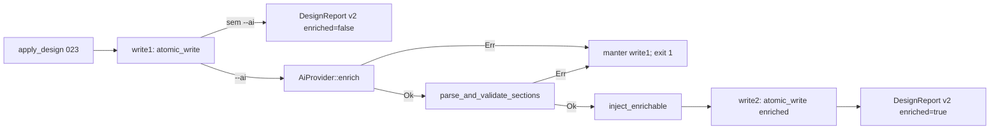

# CLI: `dare design` (Ciclos 023 + 024)

Render **determinístico** de `DARE/DESIGN.md` a partir de uma descrição posicional ou prompts interativos; enrichment opcional por IA via crate **`dare-ai`** (024). Complementa [DEC-024](../DECISION-LOG.md) (023) e [DEC-025](../DECISION-LOG.md) (024). Blueprints 023 / 024.

Source: `crates/dare-cli/src/commands/design.rs` · `crates/dare-ai/`

## Command

```bash
dare design <description...>
dare design --interactive
dare design "My API for user onboarding" --json
dare design "My API for user onboarding" --ai
dare design "My API for user onboarding" --ai --provider mock
dare design --interactive --ai [--provider codex]
```

| Flag / arg | Efeito |
|------------|--------|
| `<description...>` | Argumento posicional trailing; clap junta tokens com espaço. Obrigatório quando **não** `--interactive`. |
| `--interactive` | Prompts TTY (title + description); omitir descrição posicional. |
| `--json` | Envelope JSON (004); `data` = `DesignReport` schema **2** |
| `--no-color` | Sem ANSI (global 004) |
| `--ai` | Após render determinístico (023), invoca provider terminal-first para enriquecer secções ENRICHABLE |
| `--provider <id>` | Provider explícito; **requer** `--ai`. Valores: `mock` \| `codex` \| `claude-code` \| `cursor-cli` \| `antigravity-cli` |

### Regras de uso

| Condição | Resultado |
|----------|-----------|
| `!interactive && description vazio` | Usage exit **2** — `"description required (or --interactive)"` |
| `interactive && !description.is_empty()` | Usage exit **2** — `"cannot combine --interactive with description"` |
| `interactive && !stdin.is_terminal()` | Usage exit **2** — `"design --interactive requires a TTY"` |
| `provider.is_some() && !ai` | Usage exit **2** — `"--provider requires --ai"` |
| `description.trim().is_empty()` (após join) | InvalidInput exit **4** |
| `description.len() > 32768` | InvalidInput exit **4** (`DESC_MAX`) |
| provider id desconhecido | InvalidInput exit **4** — `"unknown provider: …"` |
| provider não implementado (`claude-code`, `cursor-cli`, `antigravity-cli` neste ciclo) | InvalidInput exit **4** — `"provider not implemented: …"` |
| project root não encontrado | InvalidInput exit **4** |
| markers AGENT malformados (BEGIN sem END) | InvalidInput exit **4** — `"malformed AGENT markers in DARE/DESIGN.md"` |
| falha de I/O em `atomic_write` | Io exit **5** |

### Default provider

| Contexto | Provider |
|----------|----------|
| Sem `--ai` | N/A — pipeline 023 puro |
| `--ai` sem `--provider` | **`codex`** (produto / dev local) |
| CI / testes | **`mock`** explicitamente (`--ai --provider mock`) |

## Path de disco (único)

| Path | Semântica |
|------|-----------|
| `DARE/DESIGN.md` | **Único** output deste comando (`DESIGN_REL`). Escrita via `atomic_write` sob `ProjectRoot`. |

Path alternativo de design (ex.: `DARE/DESIGN-*.md`) → **fora de escopo**; microplano **025**.

Leitura de ficheiro existente: cap `DESIGN_READ_CAP` = 262 144 bytes (RS-06).

## Markers ENRICHABLE (AGENT)

Delimitação parseável para merge preserve e injeção (023 coloca; 024 injeta):

```text
<!-- AGENT:BEGIN section="<id>" -->
<body>
<!-- AGENT:END section="<id>" -->
```

| `section` id | Secção do template | Conteúdo inicial (023) |
|--------------|-------------------|------------------------|
| `description` | `## 1. DESCRIÇÃO` | Texto do user |
| `objectives` | `## 2. OBJETIVOS E MÉTRICAS DE SUCESSO` | Tabela stub `[A definir]` |
| `functional-requirements` | `## 4. REQUISITOS FUNCIONAIS` | Tabela stub `[A definir]` |
| `stack` | `## 7. STACK TÉCNICA` | Tabela stub `[A definir]` |

Constantes: `MARKER_BEGIN = <!-- AGENT:BEGIN section="`; `MARKER_END_PREFIX = <!-- AGENT:END section="`.

Secções **sem** marker (stakeholders, NFR, segurança, integrações, restrições, fora de escopo, riscos, checklist) são reescritas pelo template canónico em create; em update com markers existentes, texto fora de BEGIN/END permanece intacto.

## Preserve / appendix

Algoritmo `merge_preserve`:

1. **Create** (`DESIGN.md` ausente ou vazio): escreve markdown canónico completo; `action = created`.
2. **Update com markers**: substitui apenas blocos BEGIN/END de ids `ENRICHABLE`; parágrafos/tabelas unmanaged entre markers sobrevivem; `action = updated`.
3. **Update sem markers** (ficheiro user legado): escreve `fresh` e **anexa** appendix:

```markdown
## APPENDIX — Preserved previous content

<!-- dare:preserved -->
{existing}
```

   `preservedRegions = 1`; conteúdo anterior intacto sob `dare:preserved`.

CLI alpha: **sempre** merge-preserve no path feliz (`force_full_rewrite` só em testes internos — não exposto).

## Enrichment por IA (024)

Crate **`dare-ai`**: trait `AiProvider`, providers `mock` + `codex`, validação de schema, injeção só em markers.

### Pipeline (write1 → validate → inject → write2)



| Fase | Ação | Falha |
|------|------|-------|
| **write1** | `apply_design` determinístico **sempre** executa; escreve scaffold + markers | Exit 023 (2/4/5) |
| **enrich** | `AiProvider::enrich` — spawn argv-only (`codex`) ou in-process (`mock`) | Exit **1**; ficheiro = write1 |
| **validate** | `parse_and_validate_sections` no stdout (JSON untrusted) | Exit **1** ou **4**; ficheiro = write1 |
| **inject** | `inject_enrichable` — substitui **somente** interior dos 4 markers | Exit **1** ou **4**; ficheiro = write1 |
| **write2** | `atomic_write` com markdown enriquecido | Exit **5**; ficheiro = write1 |

**Non-corrupt (RF-11):** qualquer falha após write1 **mantém** o ficheiro determinístico intacto (markers pré-enrich, texto unmanaged, appendix `dare:preserved`). Nunca escreve enrich parcial.

### Schema JSON `sections` (stdout do provider)

Objeto JSON com chave **`sections`**; **4 keys ENRICHABLE obrigatórias**; extras ignoradas.

```json
{
  "sections": {
    "description": "API de pagamentos com Stripe",
    "objectives": "| # | Objetivo | Métrica verificável | Meta |\n|---|----------|---------------------|------|\n| O-01 | Checkout | taxa sucesso | > 99% |",
    "functional-requirements": "| ID | Requisito | Prioridade | Critério de aceite |\n|----|-----------|------------|--------------------|\n| RF-01 | Cobrar cartão | MUST | webhook 2xx |",
    "stack": "| Camada | Tecnologia | Versão |\n|--------|-----------|--------|\n| Backend | Rust | 1.85 |"
  }
}
```

Validação (`parse_and_validate_sections`):

| Regra | Rejeição |
|-------|----------|
| stdout não é JSON | InvalidInput — `"enrichment response is not JSON"` |
| `sections` ausente ou não-objeto | InvalidInput |
| Key ENRICHABLE ausente | InvalidInput |
| Value não-string, vazio após trim, ou `len > BODY_MAX` (65 536) | InvalidInput |
| Body contém `AGENT:BEGIN` ou `AGENT:END` | InvalidInput (evita marker nesting) |

Fixtures: `tests/fixtures/ai/mock-sections-{valid,missing-key,oversize}.json`.

### Env overrides (`DARE_*_COMMAND`)

Parse como **argv whitespace-split** (sem shell, sem quotes interpretadas); primeiro token = program.

| Variável | Provider | Default argv |
|----------|----------|--------------|
| `DARE_CODEX_COMMAND` | `codex` | `codex exec` (+ prompt via stdin ou prompt file sob jail) |
| `DARE_CLAUDE_COMMAND` | `claude-code` | não implementado neste ciclo |
| `DARE_CURSOR_COMMAND` | `cursor-cli` | não implementado neste ciclo |
| `DARE_ANTIGRAVITY_COMMAND` | `antigravity-cli` | não implementado neste ciclo |

Timeout por invocação real: **`ENRICH_TIMEOUT` = 20 minutos** (`Duration::from_secs(20 * 60)`). Expiração → kill árvore (006); exit **1**.

Caps: `STDOUT_CAP` = 1 048 576; `BODY_MAX` = 65 536 por secção; `PROMPT_LOG_MAX` = 256 chars em logs (redact).

### Providers (024)

| Id | Implementação | CI |
|----|---------------|-----|
| `mock` | `MockProvider` in-process; JSON determinístico; zero spawn | **Obrigatório** em smokes |
| `codex` | `CodexCliProvider::from_env()`; spawn `SafeCommand` | Opcional local; não gate CI |
| `claude-code` | `resolve_provider` → InvalidInput `"provider not implemented: …"` | — |
| `cursor-cli` | idem | — |
| `antigravity-cli` | idem | — |

## Interactive (TTY)

Prompts en-US, ordem congelada:

1. `Title (empty = derive from description): `
2. `Description: ` (single line alpha)

Requer stdin TTY (`std::io::IsTerminal`). Pipe ou CI sem TTY + `--interactive` → Usage exit **2**.

## Exit codes

| Code | Quando |
|------|--------|
| 0 | Sucesso (com ou sem `--ai`; enrich OK quando `--ai`) |
| 1 | Internal **ou** falha de provider / timeout / schema / inject **após** write1 determinístico |
| 2 | Usage (clap; regras acima; `--provider` sem `--ai`; `--interactive` sem TTY) |
| 4 | InvalidInput (root null, descrição vazia/oversize, path jail, markers malformados, provider id desconhecido, schema inválido, caps) |
| 5 | Io (falha read/write) |

Exit **3** (NotFound) reservado a `--dir` futuro — não exposto neste ciclo.

## DesignReport schema 2 (congelado)

Substitui schema 1 (023). Campos camelCase em `--json`:

| Field | Type | Notes |
|-------|------|-------|
| `schemaVersion` | number | Always **`2`** |
| `mode` | string | Always `"design"` |
| `ok` | bool | `true` on success |
| `path` | string | `"DARE/DESIGN.md"` (POSIX relativo) |
| `action` | string | `"created"` \| `"updated"` |
| `title` | string | Título usado no header |
| `markerCount` | number | Pares BEGIN/END escritos (esperado: 4) |
| `preservedRegions` | number | Blocos unmanaged preservados (0 ou ≥1) |
| `interactive` | bool | Eco da flag CLI |
| `warnings` | string[] | ex.: title truncated to 60 chars |
| `ai` | bool | Eco de `--ai` |
| `provider` | string \| null | Id do provider se `ai`; senão `null` |
| `enriched` | bool | `true` só se inject + write2 OK |

Bump requer ADR + migration note.

### Human output (exemplo com `--ai`)

```text
design: ok
path: DARE/DESIGN.md
action: created
title: My API
markerCount: 4
preservedRegions: 0
ai: true
provider: mock
enriched: true
mode: design
```

## Fixtures / snapshots

Diretório design: `tests/fixtures/design/`

| Ficheiro | Uso |
|----------|-----|
| `input-basic.txt` | Descrição fixa para golden tests |
| `golden-basic.md` | Estrutura esperada; data normalizada (`1970-01-01` em unit) |
| `existing-with-notes.md` | Fixture preserve — notes unmanaged sobrevivem após regenerate |

Diretório AI: `tests/fixtures/ai/` — ver § Schema JSON.

Testes:

```bash
cargo test -p dare-ai
cargo test -p dare-cli -- design
cargo test -p dare-cli --test cli_smoke -- design
```

Smokes MUST: `design_creates_file`, `design_json_schema` (schemaVersion **2**), `design_empty_desc_usage_or_4`, `design_preserve_notes`, `design_interactive_no_tty_exits_2`, `design_without_ai_schema_v2`, `design_ai_mock_enriches`, `design_ai_schema_fail_keeps_file`, `design_provider_without_ai_usage`, `design_unknown_provider`.

## Fora de escopo

| Item | Microplano |
|------|------------|
| `dare blueprint` / path alternativo de design | **025** |
| Enrichment de reverse / dna / migrate / patterns / review / refine | Donos + **050** |
| `dare ai doctor\|providers\|run\|prompt` | **050** |
| `AgentDriver` / `dare execute --agent` / worktrees | **030–031** |
| Claude API (`ANTHROPIC_API_KEY`) | **031** |
| `--force` full rewrite na superfície CLI | Não exposto (preserve sempre) |

## Segurança / contratos

- Path jail (`ProjectRoot` / `SafeRelativePath`) — RS-01
- `atomic_write` sob project root; write1 + write2; falha enrich não corrompe — RS-03
- `DESC_MAX` 32 768 + `DESIGN_READ_CAP` 262 144 — RS-06
- Markers comment-only (HTML comments); reject nested AGENT — RS-07 / RS-09
- Spawn argv-only; sem shell — RS-06
- Stdout provider = **untrusted** até schema pass — RS-08
- Redact secrets/tokens; prompt ≤ `PROMPT_LOG_MAX` em logs — RS-02
- CLI DARE sem API key própria; secrets só no processo filho se o CLI externo exigir — RS-05
- Mensagens de erro ≤200 chars; sem dump de descrição longa — RS-02

## Diff vs TypeScript `@dewtech/dare-cli@3.18.1`

Paridade **parcial determinística**: o TS baseline invoca LLM e emite markdown ad-hoc; o rewrite nativo 023 gera template canónico fixo + markers AGENT; 024 adiciona enrichment opcional via crate `dare-ai`.

| Item | TS 3.18.1 | Native 023+024 | Classificação |
|------|-----------|----------------|---------------|
| Geração de conteúdo | LLM / heurística variável | Template embed determinístico + enrich opcional | **C** — SoT nativo (DEC-024/025) |
| Markers `AGENT:BEGIN/END` | Ausente ou ad-hoc | 4 secções ENRICHABLE fixas | **C** |
| Merge preserve / `dare:preserved` | Comportamento histórico opaco | Algoritmo §5.3 Blueprint 023 | **B** |
| Path output | Variável / cwd-dependent | Sempre `DARE/DESIGN.md` | **A** |
| `--interactive` sem TTY | Indefinido | Usage exit **2** | **B** — CI-safe |
| `--ai` / `--provider` | Presente no TS | `mock` + `codex`; default `codex` | **B** — paridade funcional parcial |
| Falha enrich | Indefinido | write1 preserved; exit 1 | **B** — non-corrupt explícito |
| `DesignReport` JSON | Ad-hoc / ausente | `schemaVersion: 2` camelCase | **C** — ADR-002 envelope |
| Exit codes enrich | Mapa histórico TS | 0/1/2/4/5 congelado 004 + enrich | **B** |

Snapshots nativos (`golden-basic.md`, smokes mock) são **SoT alpha** para regressão — não reproduzir variabilidade LLM do TS.

## Local verify

```bash
docker compose -f docker-compose.ci.yml config
cargo test -p dare-ai
cargo test -p dare-cli -- design
cargo test -p dare-cli --test cli_smoke -- design
```

`docker compose -f docker-compose.ci.yml config` exit **0** verificado em **mp023-001** / **mp024-001** (Fase 1). Compose CI reutilizado (sem imagem nova) — herança microplanos 003/015.

**Waiver:** se Docker não estiver instalado localmente, a verificação compose pode ser omitida; CI continua a ser gate.

Dev manual (opcional, requer `codex` no PATH):

```bash
cargo run -p dare-cli -- design "Smoke API" --ai --provider mock
```

## Related

- **DEC-024** — render determinístico 023 — [`docs/DECISION-LOG.md`](../DECISION-LOG.md)
- **DEC-025** — enrichment opcional 024 — [`docs/DECISION-LOG.md`](../DECISION-LOG.md)
- Output envelope: [`cli-output-and-errors.md`](cli-output-and-errors.md)
- Path safety: [`path-safety.md`](path-safety.md)
- Process safety: [`process-safety.md`](process-safety.md)
- Capability: `dare-design` em [`capabilities-canonical.md`](capabilities-canonical.md)
- Template SoT: `assets/templates/DESIGN-template.md`
- Crate: `crates/dare-ai/`
