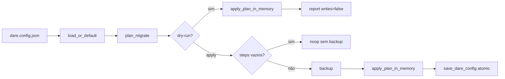

# Configuração e migrations (`dare-config`)

Microplano **008**. Carregamento, merge, validação opt-in e migrations controladas de `dare.config.json`.

Decisão: [DEC-009](../DECISION-LOG.md) · ADR-002 flatten · [`disk-and-json-policy.md`](disk-and-json-policy.md) · [`persisted-contracts.md`](persisted-contracts.md)

## Precedência

Ordem efetiva: **CLI > env `DARE_*` > ficheiro > default**  
Composição interna: `defaults ← file ← env ← cli` (última camada ganha).

### Matriz de aceite

| ID | Cenário | Resultado |
|----|---------|-----------|
| P1 | env.ide + file.ide | env vence |
| P2 | cli.ide + file.ide | cli vence |
| P3 | cli + env + file | cli vence |
| P4 | sem file/env/cli | defaults (`ide` ausente) |
| P5 | só file.ide | file vence |
| B1 | file `guard.enabled:false` + env true | env habilita guard |
| B2 | env false + cli true em guard | cli vence |
| B3 | extras no file | preservados após merge |

## Allowlist de ambiente

| Variável | Efeito | Valores |
|----------|--------|---------|
| `DARE_IDE` | override `/ide` | string non-empty |
| `DARE_GUARD_ENABLED` | `/guard/enabled` | bool grammar abaixo |
| `DARE_GRAPH_ENABLED` | `/graph/enabled` | idem |
| `DARE_AGENT_ENABLED` | `/agent/enabled` | idem |
| `DARE_HOOKS_ENABLED` | `/hooks/enabled` | idem |
| `DARE_PROJECT_ENABLED` | `/project/enabled` | idem |

**Bool grammar** (case-insensitive, trim): `true|1|yes|on` → true; `false|0|no|off` → false.  
Chaves fora da allowlist: **ignoradas**.

### Lenient vs strict

| Função | Bool inválido (`maybe`) |
|--------|-------------------------|
| `env_overrides_from_vars` | ignora a chave |
| `env_overrides_from_vars_strict` | `CoreError::Config` com pointer `/env/DARE_GUARD_ENABLED` — **sem** ecoar o valor raw |
| `env_overrides_from_os` | = strict(`std::env::vars()`) |

## API pública

```text
default_config() -> DareConfig
merge_layers(defaults, file, env, cli) -> DareConfig
validate(cfg) -> CoreResult<()>
load_effective(root, rel, env, cli) -> CoreResult<DareConfig>
env_overrides_from_vars / env_overrides_from_vars_strict / env_overrides_from_os
plan_migrate / dry_run_migrate / apply_migrate / apply_plan_in_memory
MigrateOptions, MigrationPlan, MigrationStep, MigrationStepKind, MigrateDryRunReport
CliOverrides, EnvOverrides
DEFAULT_CONFIG_REL = "dare.config.json"
```

- `NotFound` no ficheiro → defaults + overrides (sem erro).
- JSON malformado → `CoreError::Config`.
- `ide: Some("")` → erro `invalid dare.config.json at /ide: must be non-empty`.
- Blocos com `enabled: false` → **sem** validação profunda (opt-in).

## JSON Pointer (diagnóstico)

Exemplos:

- `/ide` — ide vazio
- `/env/DARE_GUARD_ENABLED` — bool env inválido (strict)

## Migrations



- **`dry_run_migrate`:** sempre `writes: false`; bytes do ficheiro inalterados.
- **`apply_migrate`:** se `steps` vazios → noop (sem backup). Se steps e ficheiro existia → `backup` em `.dare/backups/` depois write atómico.
- **`schemaVersion`:** só em `extra` quando `MigrateOptions.write_schema_version == true` (default **false**).
- Fingerprint: SHA-256 hex do JSON canónico pré-migration.

Kinds v1: `Noop`, `SetEnabled`, `WriteSchemaVersion` (novos kinds via ADR).

## Paridade TypeScript 3.18.1

| Área | Classe | Nota |
|------|--------|------|
| Precedência CLI/env/file/default | A | Alinhado DEC-009 |
| Preserve unknown keys (flatten) | A | ADR-002 |
| Deep Zod validation de cada bloco | C / COULD | Fora deste ciclo |
| CLI `dare config` / `dare migrate` | C | Microplanos de comando |

## Segurança (RS-01…RS-10)

| RS | Controlo |
|----|----------|
| RS-01 | Allowlist + validate ide + bool parse |
| RS-02 | Erros sem valor raw de env |
| RS-03 | I/O sob `ProjectRoot` / `SafeRelativePath` |
| RS-04 | `cargo audit` + `cargo deny` |
| RS-05 | Sem secrets hardcoded |
| RS-06 | Migration steps tipados (não eval JSON) |
| RS-07 | Cap 2 MiB (`dare-contracts`) |
| RS-08 | Backup antes de apply com steps |
| RS-09 | Sem shell concatenado |
| RS-10 | Dry-run nunca escreve |

## Ver também

- [`persisted-contracts.md`](persisted-contracts.md)
- [`disk-and-json-policy.md`](disk-and-json-policy.md)
- [`path-safety.md`](path-safety.md)
